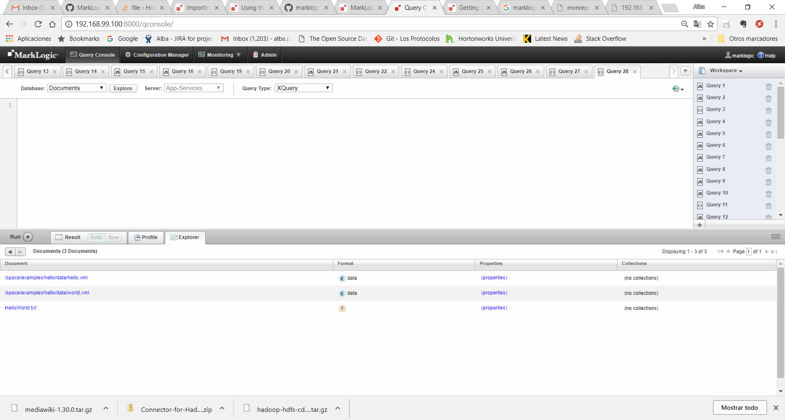
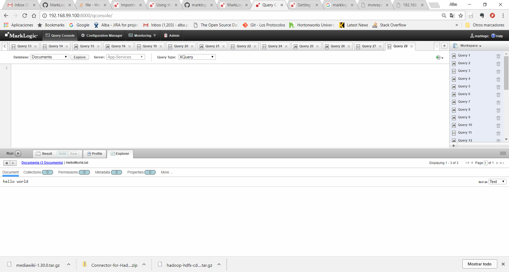
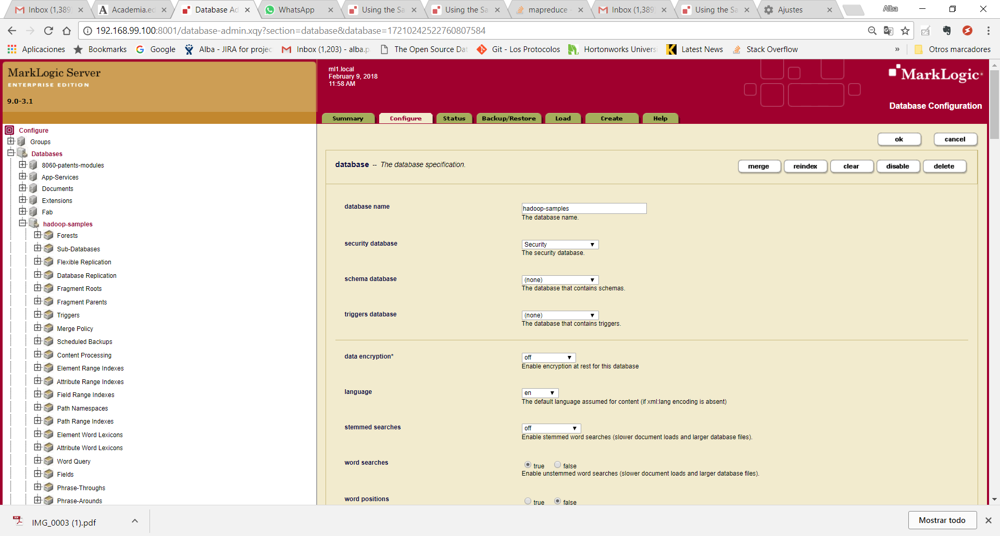
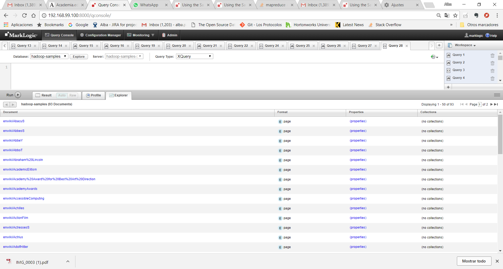
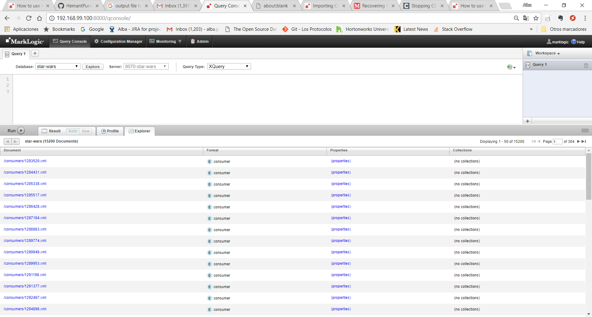
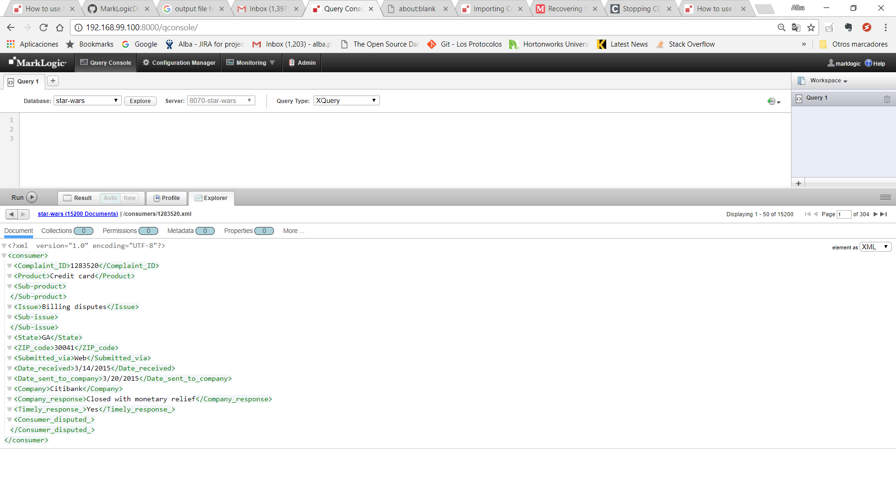

:toc: macro
:numbered:

toc::[]

= C001 Hadoop for storage and Compute

  *Description:* This is a functional user story, and it will be solved during Iteration 2,
   starting on Wednesday January 17th

  *What is included in this task:* Get to know about the integration of different data sources through Spark.
  To achieve this we will:

  1) Use the MarkLogic Connector for Hadoop to export from MarkLogic databases to a Hadoop cluster
  2) Open a Spark SQL session to query the exported data, joining them with other rdd sources

== https://docs.marklogic.com/guide/mapreduce/quickstart[Getting Started with the MarkLogic Connector for Hadoop]

This chapter provides procedures for installing and configuring Apache Hadoop MapReduce and the MarkLogic Connector for Hadoop, and for running a simple MapReduce job that interacts with MarkLogic Server.

=== https://docs.marklogic.com/guide/mapreduce/quickstart#id_19037[Security Requirements for MapReduce Jobs]

The user with which a MapReduce job accesses MarkLogic Server must have appropriate privileges
for the content accessed by the job, such as permission to read or update documents in the
target database. Specify the user in the mapreduce.marklogic.input.username and
mapreduce.marklogic.output.username job configuration properties.

In addition, the input and output user must use one of the pre-defined roles listed below:

Role	Description
*hadoop-user-read*	Enables use of MarkLogic Server as an input source for a MapReduce job.
This role does not grant any other privileges, so the mapreduce.marklogic.input.user might
still require additional privileges to read content from the target database.

*hadoop-user-write*	Enables use of MarkLogic Server as an output destination for a MapReduce
job. This role does not grant any other privileges, so the mapreduce.marklogic.output.user might
still require additional privileges to insert or update content in the target database.

*hadoop-user-all*	Combines the privileges of hadoop-user-read and hadoop-user-write.

The *hadoop-internal* role is for internal use only. Do not assign this role to any users.
This role is used to amp special privileges within the context of certain functions of the
Hadoop MapReduce Connector.

Assigning this role to users gives them privileges on the system that you typically do not want
them to have.

image::imagenes/imagen07.png[imagen07.png]

=== https://docs.marklogic.com/guide/mapreduce/quickstart#id_16099[Installing the MarkLogic Connector for Hadoop]

[NOTE]
====
*Following vendor's documentation, adding links to the source that I've read.*

*As soon as we get the whole loop we will make these steps into the Dockerfile, and also will rewrite this documentation accoring to the changes*
====

These instructions assume you have the following environment variables set:

HADOOP_CONF_DIR : The directory containing your Hadoop Configuration files.
                  This location is dependent on your Hadoop distribution. For example, CDH uses
                  /etc/hadoop/conf by default.

JAVA_HOME : The root of your JRE installation.

image::imagenes/imagen07.png[imagen07.png]

Use the following procedure to install the MarkLogic Connector for Hadoop. You might need to modify some of the
example commands, depending on your version of MarkLogic, the connector, or your Hadoop distribution.

1) Download the MarkLogic Connector for Hadoop from

 http://developer.marklogic.com/products/hadoop

2) Download XCC for Java from

 http://developer.marklogic.com/products/xcc

3) Create these folders in ml1.local:

    docker@default:~$ docker exec -it ml1.local bash

    [root@ml1 /]# mkdir /space
    [root@ml1 /]# mkdir /space/marklogic
    [root@ml1 /]# mkdir /space/marklogic/mapreduce
    [root@ml1 /]# mkdir /space/marklogic/xcc

4) Upload MarkXCC.Java-9.0.3.zip and Connector-for-Hadoop2-2.2.3.zip to their respective folders

    docker@default:/c/Users/atarinvi/Documents/2018-01-08 eDIN/MarkLogicDockerLab/marklogic-cluster/lib$
    docker cp Connector-for-Hadoop2-2.2.3.zip ml1.local:/space/marklogic/mapreduce

    docker@default:/c/Users/atarinvi/Documents/2018-01-08 eDIN/MarkLogicDockerLab/marklogic-cluster/lib$
    docker cp MarkXCC.Java-9.0.3.zip  ml1.local:/space/marklogic/xcc

5) Install the unzip command and unpack the Connector-for-Hadoop2-2.2.3.zip and MarkXCC.Java-9.0.3.zip files

    [root@ml1 mapreduce]# yum install unzip

    [root@ml1 mapreduce]# unzip Connector-for-Hadoop2-2.2.3.zip
    [root@ml1 xcc]# unzip MarkXCC.Java-9.0.3.zip

Hadoop must be configured to find the MarkLogic Connector for Hadoop libraries before you can use MarkLogic Server
in a MapReduce job. See Configuring Your Environment to Use the Connector.

=== https://docs.marklogic.com/guide/mapreduce/quickstart#id_16099[Configuring Your Environment to Use the Connector]

[NOTE]
====
*Following vendor's documentation, adding links to the source that I've read.*
e
*As soon as we get the whole loop we will make these steps into the Dockerfile, and also will rewrite this documentation accoring to the changes*
====

Before using the MarkLogic Connector for Hadoop with your Hadoop installation for the first time, set the
environment variables described in this section. Only HADOOP_CLASSPATH is required, but the rest of this guide
assumes you set the optional variables.

    [root@ml1 ~]# export CONNECTOR_HOME=/space/marklogic/mapreduce
    [root@ml1 ~]# export XCC_HOME=/space/marklogic/xcc
    [root@ml1 ~]# export HADOOP_CLASSPATH=$HADOOP_CLASSPATH:$CONNECTOR_HOME/lib/commons-modeler-2.0.1.jar
    [root@ml1 ~]# export HADOOP_CLASSPATH=$HADOOP_CLASSPATH:$CONNECTOR_HOME/lib/marklogic-mapreduce2-2.2.3.jar
    [root@ml1 ~]# export HADOOP_CLASSPATH=$HADOOP_CLASSPATH:$XCC_HOME/lib/marklogic-xcc-9.0.3.jar

    [root@ml1 main]# echo $HADOOP_CLASSPATH
    :/space/marklogic/mapreduce/lib/commons-modeler-2.0.1.jar:
    /space/marklogic/mapreduce/lib/marklogic-mapreduce2-2.2.3.jar:
    /space/marklogic/xcc/lib/marklogic-xcc-9.0.3.jar

    [root@ml1 ~]# export LIBJARS=$CONNECTOR_HOME/lib/commons-modeler-2.0.1.jar,$CONNECTOR_HOME/lib/marklogic-mapreduce2-2.2.3.jar,$XCC_HOME/lib/marklogic-xcc-9.0.3.jar

    [root@ml1 ~]# echo $LIBJARS
    /space/marklogic/mapreduce/lib/commons-modeler-2.0.1.jar,
    /space/marklogic/mapreduce/lib/marklogic-mapreduce2-2.2.3.jar,
    /space/marklogic/xcc/lib/marklogic-xcc-9.0.3.jar

Let's make a script so that everytime we open a session, the environment is configured:

Hadoop MapReduce and the MarkLogic Connector for Hadoop are now ready for use.

=== https://docs.marklogic.com/guide/mapreduce/quickstart#id_92175[Running the HelloWorld Sample Application. Connecting the MarkLogic node located in ml1.local to the Hadoop single node cluster installed in the same ml1.local node]

[NOTE]
====
*Following vendor's documentation, adding links to the source that I've read.*

*As soon as we get the whole loop we will make these steps into the Dockerfile, and also will rewrite this documentation accoring to the changes*
====

The section walks through configuring and running a simple HelloWorld sample job, assuming MarkLogic Server and
Apache Hadoop are installed on the same single node, as described in Installing the MarkLogic Connector for Hadoop.

==== https://hadoop.apache.org/docs/stable/hadoop-project-dist/hadoop-common/SingleCluster.html[Install a single node Hadoop cluster in ml1.local]

[source]
----

root@atarinvi:/home/atarinvi/Documentos/2018-01-17 eDIN/MarkLogicDockerLab/marklogic-cluster# docker exec -it ml1.local bash
[root@ml1 /]#

[root@ml1 /]# cd space/marklogic/
[root@ml1 /]# wget http://ftp.cixug.es/apache/hadoop/common/current/hadoop-3.0.0.tar.gz
[root@ml1 /]# tar xvfz hadoop-3.0.0.tar.gz
[root@ml1 /]# cd hadoop-3.0.0
[root@ml1 hadoop-3.0.0]# chmod +x etc/hadoop/*.sh
[root@ml1 hadoop-3.0.0]# vi etc/hadoop/hadoop-env.sh

[root@ml1 hadoop-3.0.0]# etc/hadoop/hadoop-env.sh
[root@ml1 hadoop-3.0.0]# mkdir input
[root@ml1 hadoop-3.0.0]# cp etc/hadoop/*.xml input
[root@ml1 hadoop-3.0.0]# bin/hadoop jar share/hadoop/mapreduce/hadoop-mapreduce-examples-3.0.0.jar grep input output 'dfs[a-z.]+'

[root@ml1 hadoop-3.0.0]# cat output/part-r-00000
1	dfsadmin

[root@ml1 hadoop-3.0.0]# vi etc/hadoop/core-site.xml
. . .
<configuration>
    <property>
        <name>fs.defaultFS</name>
        <value>hdfs://localhost:9000</value>
    </property>
</configuration>

[root@ml1 hadoop-3.0.0]# vi etc/hadoop/hdfs-site.xml

. . .

<configuration>
    <property>
        <name>dfs.replication</name>
        <value>1</value>
    </property>
</configuration>

[root@ml1 hadoop-3.0.0]# bin/hdfs namenode -format

[root@ml1 hadoop-3.0.0]# groupadd hdfs
[root@ml1 hadoop-3.0.0]# useradd hdfs -g hdfs
[root@ml1 hadoop-3.0.0]# passwd hdfs
Changing password for user hdfs.
New password:
BAD PASSWORD: The password is shorter than 8 characters
Retype new password:
passwd: all authentication tokens updated successfully.

[root@ml1 hadoop-3.0.0]# yum install openssh-clients

[root@ml1 hadoop-3.0.0]# su - hdfs
Last login: Fri Jan 19 08:47:29 UTC 2018 on pts/0
[hdfs@ml1 ~]$ cd /space/marklogic/hadoop-3.0.0
[hdfs@ml1 marklogic]$ chown -r hdfs.hdfs hadoop-3.0.0

[hdfs@ml1 hadoop-3.0.0]$ sbin/start-dfs.sh
Starting namenodes on [localhost]
localhost: /space/marklogic/hadoop-3.0.0/libexec/hadoop-functions.sh: line 981: ssh: command not found
Starting datanodes
localhost: /space/marklogic/hadoop-3.0.0/libexec/hadoop-functions.sh: line 981: ssh: command not found
Starting secondary namenodes [ml1.local]
ml1.local: /space/marklogic/hadoop-3.0.0/libexec/hadoop-functions.sh: line 981: ssh: command not found

   91  ssh localhost
   92  uname -n
   93  uname -a
   95  yum install openssh
   96  ssh
   97  yum install openssh-client
   98  yum install openssh-server
   99  service ssh status
  100  service ssh start
  101  sudo service ssh start
  102  ssh
  103  vi /etc/ssh/sshd_config
  104  sudo service ssh start
  105  service ssh start
  106  systemctl start ssh.service

----
==== Run the HelloWorld Sample

The following steps are covered:

    Selecting the App Server and Database
    Loading the Sample Data
    Configuring the Job
    Running the Job

*Selecting the App Server and Database*

The MarkLogic Connector for Hadoop requires a MarkLogic Server installation configured with an XDBC App Server. When you install MarkLogic Server, a suitable XDBC App Server attached to the Documents database comes pre-configured on port 8000.

The example commands in this guide assume you're using this port 8000 App Server and database, and therefore no additional setup is required.

However, you can choose to use a different database or App Server and database:

    To use the pre-configured App Server on port 8000 with a different database, set the com.marklogic.output.databasename configuration property when you follow the steps in Configuring the Job. (A similar property exists for overriding the default database when using MarkLogic for output.)
    To create your own XDBC App Server on a different port, attached to a different database, see the Administrator's Guide, then configure your job appropriately when you get to Configuring the Job.

*Loading the Sample Data*

This section covers loading the sample data in two ways: Using Query Console to load the data using simple XQuery, or using the MarkLogic Content Pump (mlcp) command.

    Loading Sample Data with mlcp
    Loading Sample Data Manually

*Loading Sample Data with mlcp*

MarkLogic Content Pump (mlcp) is a command line tool transferring content into or out of MarkLogic Server, or copying content between MarkLogic Server instances.

Before running this procedure, you should have mlcp installed and the mlcp bin/ directory on your path; for details, see Installation and Configuration in the mlcp User Guide.

Follow these instructions to initialize the input database using MarkLogic Content Pump (mlcp).

1) Create a directory to use as your work area and cd into it. This directory can be located anywhere. For example:

    mkdir /space/examples/hello
    cd /space/examples/hello

2) Create a data subdirectory to hold the sample data files. For example:

    mkdir data

3) Create a text file called 'hello.xml' in your data directory with the contents shown below:

    <data><child>hello mom</child></data>

4) For example, run the following command:

    cat > data/hello.xml
    <data><child>hello mom</child></data>
    ^D

5) Create a text file called 'world.xml' in your data directory with the contents shown below:

    <data><child>world event</child></data>

6) For example, run the following command:

    cat > data/world.xml
    <data><child>world event</child></data>
    ^D

7) Use mlcp to load the input files into the database you created in Selecting the App Server and Database. Use a username and password with update privileges for the input database. Use the port number of the XDBC App Server you previously created. Use the -output_uri_replace option to strip off the directory prefix from the database document URI. For example:

    $ mlcp.sh import -username user -password password -host localhost \
        -port 8000 -input_file_path /space/examples/hello/data \
        -output_uri_replace "/space/examples/hello/data/,''"

8) Optionally, use Query Console to confirmthe load: Open Query Console and click the Explore button at the top of the query editor to examine the database contents. You should see hello.xml and world.xml in the database.

9) You can also use mlcp to load files from HDFS by specifying an HDFS path for -input_file_path. For example, if your files are in HDFS under /user/me/hello/data, then you could use the following command:

$ mlcp.sh import -username user -password password -host localhost \
    -port 8000 -input_file_path hdfs:/user/me/hello/data \
    -output_uri_replace "/user/me/hello/data/,''"

*Loading Sample Data Manually*

Follow these instructions to initialize the input database with the sample documents using Query Console. For details about Query Console, see the Query Console User Guide.

To load the database with the sample data:

    Using your browser, launch Query Console on the MarkLogic Server instance to be used as an input source. For example, if the input XDBC App Server is running on myhost, visit this URL in the browser:

    http://myhost:8000/qconsole

    Create a new query in Query Console and replace the default contents with the following:

    xquery version "1.0-ml";

    let $hello := <data><child>hello mom</child></data>
    let $world := <data><child>world event</child></data>

    return(
      xdmp:document-insert("hello.xml", $hello),
      xdmp:document-insert("world.xml", $world)
    )

    In the Content Source dropdown, select the input XDBC App Server you configured for input in Selecting the App Server and Database.
    Select Text as the output format and click Run to execute the query.
    Click the Explore button at the top of the query editor to examine the database contents. You should see hello.xml and world.xml in the database.

*Configuring the Job*

Before running the HelloWorld sample job, set the connector configuration properties that identify the MarkLogic Server user and instance for input and output.

Although the input and output MarkLogic Server instances and users can be different, this example configures the job to use the same host, port, and database for both input and output.

Configuration also includes an input and an output user name and password. Choose (or create) a MarkLogic user with sufficient privileges to access your XDBC App Server, and read and insert documents in the attached database. If using a non-admin user, assign the user to the hadoop-user-all role. For details, see Security Requirements for MapReduce Jobs.

To configure the job:

    Copy the marklogic-hello-world.xml configuration file from $CONNECTOR_HOME/conf to your work area. For example:

    $ cp $CONNECTOR_HOME/conf/marklogic-hello-world.xml /space/examples/hello

    Edit your local copy of marklogic-hello-world.xml to configure your input and output host name, port,
    user name, and password. Set the following parameters to match your environment:

    mapreduce.marklogic.input.username
    mapreduce.marklogic.input.password
    mapreduce.marklogic.input.host
    mapreduce.marklogic.input.port
    mapreduce.marklogic.output.username
    mapreduce.marklogic.output.password
    mapreduce.marklogic.output.host
    mapreduce.marklogic.output.port

    The configured input user must have sufficient privileges to access the XDBC App Server identified by the input host/port and to read documents from the input database.

    The configured output user must have sufficient privileges to access the XDBC App Server identified by the output host/port and to insert documents in the output database.

For example, if your MarkLogic installation is on localhost and you use the pre-configured App Server on port 8000 with the username and password 'my-user' and 'my-password' for input, then your input connection related property settings should be similar to the following after editing:

    <property>
      <name>mapreduce.marklogic.input.username</name>
      <value>my-user</value>
    </property>
    <property>
      <name>mapreduce.marklogic.input.password</name>
      <value>my-password</value>
    </property>
    <property>
      <name>mapreduce.marklogic.input.host</name>
      <value>localhost</value>
    </property>
    <property>
      <name>mapreduce.marklogic.input.port</name>
      <value>8000</value>
    </property>

Your output connection related property settings should have similar values.
Running the Job

The HelloWorld sample reads the first word of text from the input documents, concatenates the words into a string, and saves the result as HelloWorld.txt. Assuming the database contains only the documents created in Loading the Sample Data, the output document contains the phrase 'hello world'. If your database contains additional documents, you get different results.

To view the sample code, see $CONNECTOR_HOME/src/com/marklogic/mapreduce/examples.

Use the following procedure to run the example MapReduce job:

    If you are not already in your work area, change to that directory. For example:

    cd /space/examples/hello

    Ensure the hadoop command is in your path.
    Run the HelloWorld job using the following command. Modify the connector JAR file name as needed for your installation.

    hadoop jar \
      $CONNECTOR_HOME/lib/marklogic-mapreduce-examples-version.jar \
      com.marklogic.mapreduce.examples.HelloWorld -libjars $LIBJARS \
      -conf marklogic-hello-world.xml

The -conf command line option tells Hadoop where to get application-specific configuration information. You can also add a configuration directory to HADOOP_CLASSPATH.

As the job runs, Hadoop reports the job progress to stdout. If the sample job does not run or does not produce the expected results, see Troubleshooting and Debugging.

Near the end of the job output, you should see text similar to the following. Notice there are 2 map input records (hello.xml and world.xml), 2 map output records (the first word from each input record), and 1 reduce output record (HelloWorld.txt).

        timestamp INFO mapreduce.Job:  map 100% reduce 100%
        timestamp INFO mapreduce.Job: Job jobId completed successfully
        timestamp mapreduce.Job: Counters: 33
        File System Counters
                ...
            Map-Reduce Framework
                    Map input records=2
                    Map output records=2
                    Map output bytes=20
                    Map output materialized bytes=30
                    Input split bytes=91
                    Combine input records=0
                    Combine output records=0
                    Reduce input groups=1
                    Reduce shuffle bytes=30
                    Reduce input records=2
                    Reduce output records=1

Use Query Console to explore the output database and examine the output document, HelloWorld.txt. The document should contain the phrase 'hello world'.

If you do not see the expected output, see the tips in Troubleshooting and Debugging.

== http://docs.marklogic.com/guide/mlcp/install#id_14263[Importing and exporting data to a Hadoop cluster with mlcp tool]
[NOTE]
====
*THIS IS THE SPECTED PRODUCTION SCENARIO: MARKLOGIC CLUSTER IN PRODUCTION SHOULD BE EXPECTED TO BE MOVING DATA
   TO AND FROM A HADOOP CLUSTER (quickstart.cloudera), NOT TO A LOCAL HADOOP PROCESS!*
====
=== Installation

Installing mlcp on ml1.local host:

0) Enter to ssh ml1.local host

    docker exec -it ml1.local bash

1) Download mlcp from http://developer.marklogic.com/products/mlcp

2) Unzip mlcp-9.0.4-bin.zip

3) Put the mlcp bin directory on your path

    export PATH=${PATH}:/tmp/mlcp-Hadoop2-1.3-2/bin

=== Configuring distributed mode

4) If you plan to use mlcp in distributed mode, you must have a Hadoop installation and must configure your environment so mlcp can find your Hadoop installation.

5) Upload Cloudera's QuickStart /etc/hadoop/conf folder content to ml1.local as said om
       http://docs.marklogic.com/guide/mlcp/install#id_90074[Configuring Distributed Mode]:

       [root@ml1 ~]# mkdir /etc/hadoop
       [root@ml1 ~]# mkdir /etc/hadoop/conf

       docker@default:/c/Users/atarinvi/Documents/2018-01-08 eDIN/MarkLogicDockerLab/marklogic-cluster/resources/etc/hadoop/conf$
       docker cp README ml1.local:/etc/hadoop/conf

         [root@ml1 ~]# ls -rlht /etc/hadoop/conf/
         total 40K
         -rwxrwxrwx 1 1000 ftp 2.4K Feb 23  2016 yarn-site.xml
         -rwxrwxrwx 1 1000 ftp 1.1K Feb 23  2016 README
         -rwxrwxrwx 1 1000 ftp 2.9K Feb 23  2016 hadoop-metrics.properties
         -rwxrwxrwx 1 1000 ftp 1.4K Feb 23  2016 hadoop-env.sh
         -rwxrwxrwx 1 1000 ftp  12K Mar 23  2016 log4j.properties
         -rwxrwxrwx 1 1000 ftp 1.6K Apr  5  2016 mapred-site.xml
         -rwxrwxrwx 1 1000 ftp 3.7K Apr  5  2016 hdfs-site.xml
         -rwxrwxrwx 1 1000 ftp 1.9K Apr  5  2016 core-site.xml

6) Add hostname property to yarn-site.xml file in /etc/hadoop/conf (by default it is 0.0.0.0)

      <property>
       <name>yarn.resourcemanager.hostname</name>
        <value>quickstart.cloudera</value>
      </property>

=== Exporting data from Marklogic Server to Hadoop Cluster

7) Export characters json files from star-wars database:

    [root@ml1 ~]# mlcp.sh export -hadoop_conf_dir /etc/hadoop/conf -mode distributed -host 192.168.99.100 -port 8070 -username marklogic -password marklogic -output_file_path /user/cloudera/starwars -directory_filter /character/

    18/02/01 10:29:28 INFO contentpump.ContentPump: Job name: distributed_177986407_1
    18/02/01 10:29:28 INFO client.RMProxy: Connecting to ResourceManager at quickstart.cloudera/172.18.                                                                                          0.5:8032
    18/02/01 10:29:45 INFO mapreduce.MarkLogicInputFormat: Fetched 1 forest splits.
    18/02/01 10:29:45 INFO mapreduce.MarkLogicInputFormat: Made 1 split(s).
    18/02/01 10:29:45 INFO mapreduce.JobSubmitter: number of splits:1
    18/02/01 10:29:45 INFO mapreduce.JobSubmitter: Submitting tokens for job: job_1517475693323_0001
    18/02/01 10:29:46 INFO impl.YarnClientImpl: Submitted application application_1517475693323_0001
    18/02/01 10:29:46 INFO mapreduce.Job: The url to track the job: http://quickstart.cloudera:8088/pro                                                                                          xy/application_1517475693323_0001/
    18/02/01 10:29:46 INFO mapreduce.Job: Running job: job_1517475693323_0001
    18/02/01 10:30:00 INFO mapreduce.Job: Job job_1517475693323_0001 running in uber mode : false
    18/02/01 10:30:00 INFO mapreduce.Job:  map 0% reduce 0%
    18/02/01 10:30:09 INFO mapreduce.Job:  map 100% reduce 0%
    18/02/01 10:30:10 INFO mapreduce.Job: Job job_1517475693323_0001 completed successfully
    18/02/01 10:30:10 INFO mapreduce.Job: Counters: 33
        File System Counters
                FILE: Number of bytes read=0
                FILE: Number of bytes written=134674
                FILE: Number of read operations=0
                FILE: Number of large read operations=0
                FILE: Number of write operations=0
                HDFS: Number of bytes read=116
                HDFS: Number of bytes written=11202
                HDFS: Number of read operations=1
                HDFS: Number of large read operations=0
                HDFS: Number of write operations=14
        Job Counters
                Launched map tasks=1
                Rack-local map tasks=1
                Total time spent by all maps in occupied slots (ms)=7325
                Total time spent by all reduces in occupied slots (ms)=0
                Total time spent by all map tasks (ms)=7325
                Total vcore-seconds taken by all map tasks=7325
                Total megabyte-seconds taken by all map tasks=7500800
        Map-Reduce Framework
                Map input records=14
                Map output records=14
                Input split bytes=116
                Spilled Records=0
                Failed Shuffles=0
                Merged Map outputs=0
                GC time elapsed (ms)=82
                CPU time spent (ms)=740
                Physical memory (bytes) snapshot=142995456
                Virtual memory (bytes) snapshot=658542592
                Total committed heap usage (bytes)=126418944
        com.marklogic.mapreduce.MarkLogicCounter
                ESTIMATED_INPUT_RECORDS=14
                INPUT_RECORDS=14
                OUTPUT_RECORDS=14
        File Input Format Counters
                Bytes Read=0
        File Output Format Counters
                Bytes Written=11202

8) Check if files are in hdfs (go to quickstart.cloudera host)

    [root@quickstart tmp]# hdfs dfs -ls /user/cloudera/starwars/character
    Found 14 items
    -rw-r--r--   1 root cloudera        940 2018-02-01 10:30 /user/cloudera/starwars                                                                                                             /character/c3po.json
    -rw-r--r--   1 root cloudera        486 2018-02-01 10:30 /user/cloudera/starwars                                                                                                             /character/darthsidious.json
    -rw-r--r--   1 root cloudera       1195 2018-02-01 10:30 /user/cloudera/starwars                                                                                                             /character/darthvader.json
    -rw-r--r--   1 root cloudera        768 2018-02-01 10:30 /user/cloudera/starwars                                                                                                             /character/hansolo.json
    -rw-r--r--   1 root cloudera        637 2018-02-01 10:30 /user/cloudera/starwars                                                                                                             /character/jarjarbinks.json
    -rw-r--r--   1 root cloudera       1351 2018-02-01 10:30 /user/cloudera/starwars                                                                                                             /character/landocalrissian.json
    -rw-r--r--   1 root cloudera        765 2018-02-01 10:30 /user/cloudera/starwars                                                                                                             /character/leiaorgana.json
    -rw-r--r--   1 root cloudera        535 2018-02-01 10:30 /user/cloudera/starwars                                                                                                             /character/lorthneeda.json
    -rw-r--r--   1 root cloudera        847 2018-02-01 10:30 /user/cloudera/starwars                                                                                                             /character/lukeskywalker.json
    -rw-r--r--   1 root cloudera        594 2018-02-01 10:30 /user/cloudera/starwars                                                                                                             /character/macewindu.json
    -rw-r--r--   1 root cloudera        440 2018-02-01 10:30 /user/cloudera/starwars                                                                                                             /character/maximilianveers.json
    -rw-r--r--   1 root cloudera       1076 2018-02-01 10:30 /user/cloudera/starwars                                                                                                             /character/obiwankenobi.json
    -rw-r--r--   1 root cloudera        690 2018-02-01 10:30 /user/cloudera/starwars                                                                                                             /character/padmeamidala.json
    -rw-r--r--   1 root cloudera        878 2018-02-01 10:30 /user/cloudera/starwars

== https://docs.marklogic.com/guide/mapreduce/quickstart#id_54760[Making the Connector Available Across a Hadoop Cluster]

[NOTE]
====
*Following vendor's documentation, adding links to the source that I've read.*

*FOLLOWED A MESSY DOCUMENTATION, USED AN OPENSOURCE GIT PROJECT PROVIDED AND FOUND AN ERROR.*

*IMPORTANT: FOLLOW THE BELOW INSTRUCTIONS ON QUICKSTART.CLOUDERA HOST*
====

When you submit a MapReduce job to run on an Apache Hadoop cluster, the job resources must be accessible by the
master Job Tracker node and all worker nodes. Job resources include the job JAR file, configuration files, and
all dependent libraries. When you use the MarkLogic Connector for Hadoop in your job, this includes the
connector and XCC JAR files.

You must always have the job resources available on the Hadoop node where you launch the job. Depending on the
method you use to make the job resource available across the cluster, dependent JAR files, such as the MarkLogic
Connector for Hadoop libraries must be on the HADOOP_CLASSPATH on the node where you launch the job, as
described in Configuring Your Environment to Use the Connector.

Hadoop offers many options for making job resources available to the worker nodes, including:

  * Using the -libjars Hadoop command line option and parsing the options in your main class using
    org.apache.hadoop.util.GenericOptionsParser.

  * Bundling dependent libraries and other resources into your job JAR file.

  * Storing dependent libraries and other resources in HDFS or other shared file system and using the Apache
    Hadoop Distributed Cache to locate and load them.

  * Installing required software on all nodes in the cluster.

The best solution depends upon the needs of your application and environment. See the Apache Hadoop
documentation for more details on making resources available across a Hadoop cluster.

This guide uses -libjars.

==== Accessing the Connector Source Code

The MarkLogic Connector for Hadoop is developed and maintained as an open source project on GitHub.
To access the sources or contribute to the project, navigate to the following URL in your browser:

http://github.com/marklogic/marklogic-contentpump

The GitHub project includes both the connector and the mlcp command line tool.

*Steps to use this project:*

 [root@ml1 main]# yum install java-1.8.0-openjdk

2) Download the zip, put it into ml1.local and unpack it:

   https://github.com/marklogic/marklogic-contentpump/archive/marklogic-contentpump.zip

   docker@default:/c/Users/apastorr/MarkLogicDockerLab/marklogic-cluster/lib$
   docker cp marklogic-contentpump-master.zip ml1.local:/space/marklogic/marklogic-contentpump

   [root@ml1 marklogic]# unzip marklogic-contentpump-master.zip

3) mlcp and Hadoop Connector can be built together. Steps to build:

    root@ml1 marklogic]# cd marklogic-contentpump
    root@ml1 marklogic]# mvn clean package -DskipTests=true

4) The build writes to the respective deliverable directory under the top-level ./mlcp/ and ./mapreduce/ directories.

    [root@quickstart marklogic-contentpump]# ls
    CONTRIBUTING.md  LICENSE.txt  mapreduce  mlcp  pom.xml  README.md
    [root@quickstart marklogic-contentpump]# cd mapreduce/
    [root@quickstart mapreduce]# ls
    deliverable  LEGALNOTICES.txt  pom.xml  src  target
    [root@quickstart mapreduce]# cd deliverable/
    [root@quickstart deliverable]# ls
    Connector-for-Hadoop2-2.2.4-src.zip  Connector-for-Hadoop2-2.2.4.zip
    [root@quickstart marklogic-contentpump]# cd mlcp
    [root@quickstart mlcp]# ls
    deliverable  LEGALNOTICES.txt  pom.xml  src  target
    [root@quickstart mlcp]# cd deliverable
    [root@quickstart deliverable]# ls
    mlcp-9.0.4-bin.zip  mlcp-9.0.4-src.zip

5) Unzip Connector-for-Hadoop2-2.2.4.zip and follow the steps described on point 1.2 and 1.3 (Installing and Configuring your environment to use the connector)

6) Once you have installed and configured the Connector for Hadoop and the mlcp tool you can run mapreduces jobs using hadoop.

==== https://docs.marklogic.com/guide/mapreduce/samples[Running mapreduce jobs]

===== Example 1: HelloWorld (Input Marklogic and Output Marklogic)
[NOTE]
====
Reads the first word from text in input XML documents, concatentates the words, then stores the results as a new text document in MarkLogic Server.
====

1) Sample application HelloWord source code:

HelloWord.java

        package com.marklogic.mapreduce.examples;
        import java.io.IOException;
        import java.util.Collections;
        import java.util.ArrayList;
        import java.util.Iterator;
        import org.w3c.dom.Document;
        import org.w3c.dom.Node;
        import org.apache.commons.logging.Log;
        import org.apache.commons.logging.LogFactory;
        import org.apache.hadoop.conf.Configuration;
        import org.apache.hadoop.io.IntWritable;
        import org.apache.hadoop.io.Text;
        import org.apache.hadoop.mapreduce.Job;
        import org.apache.hadoop.mapreduce.Mapper;
        import org.apache.hadoop.mapreduce.Reducer;
        import org.apache.hadoop.util.GenericOptionsParser;
        import com.marklogic.mapreduce.ContentOutputFormat;
        import com.marklogic.mapreduce.ContentType;
        import com.marklogic.mapreduce.DatabaseDocument;
        import com.marklogic.mapreduce.DocumentInputFormat;
        import com.marklogic.mapreduce.DocumentURI;
        import com.marklogic.mapreduce.MarkLogicNode;

        public class HelloWorld {
            public static class MyMapper
            extends Mapper<DocumentURI, DatabaseDocument, IntWritable, Text> {
                public static final Log LOG =
                    LogFactory.getLog(MyMapper.class);
                private final static IntWritable one = new IntWritable(1);
                private Text firstWord = new Text();

                public void map(DocumentURI key, DatabaseDocument value, Context context)
                throws IOException, InterruptedException {
                    if (key != null && value != null && value.getContentSize() != 0) {
                        ContentType contentType = value.getContentType();
                        if (contentType == ContentType.XML) {
                            // grab the first word from the document text
                            Document doc = (Document)value.getContentAsMarkLogicNode().get();
                            String text = doc.getDocumentElement().getTextContent();
                            firstWord.set(text.split(" ", 2)[0]);
                            context.write(one, firstWord);
                        }
                    } else {
                        LOG.error("key: " + key + ", value: " + value);
                    }
                }
            }

            public static class MyReducer
            extends Reducer<IntWritable, Text, DocumentURI, Text> {
                public static final Log LOG =
                    LogFactory.getLog(MyMapper.class);
                private Text result = new Text();
                private static final DocumentURI outputURI =
                    new DocumentURI("HelloWorld.txt");
                private String allWords = new String();

                public void reduce(IntWritable key, Iterable<Text> values,
                        Context context
                        ) throws IOException, InterruptedException {
                    // Sort the words
                    ArrayList<String> words = new ArrayList<String>();
                    for (Text val : values) {
                        words.add(val.toString());
                    }
                    Collections.sort(words);

                    // concatenate the sorted words into a single string
                    allWords = "";
                    Iterator<String> iter = words.iterator();
                    while (iter.hasNext()) {
                        allWords += iter.next() + " ";
                    }

                    // save the final result
                    result.set(allWords.trim());
                    context.write(outputURI, result);

                }
            }

            public static void main(String[] args) throws Exception {
                Configuration conf = new Configuration();

                String[] otherArgs = new GenericOptionsParser(conf, args).getRemainingArgs();
                Job job = Job.getInstance(conf, "hello world");
                job.setJarByClass(HelloWorld.class);

                // Map related configuration
                job.setInputFormatClass(DocumentInputFormat.class);
                job.setMapperClass(MyMapper.class);
                job.setMapOutputKeyClass(IntWritable.class);
                job.setMapOutputValueClass(Text.class);

                // Reduce related configuration
                job.setReducerClass(MyReducer.class);
                job.setOutputFormatClass(ContentOutputFormat.class);
                job.setOutputKeyClass(DocumentURI.class);
                job.setOutputValueClass(Text.class);

                conf = job.getConfiguration();
                conf.addResource("marklogic-hello-world.xml");

                System.exit(job.waitForCompletion(true) ? 0 : 1);
            }
        }

1) Edit configuration file for Marklogic input and output (Use the pre-configured XDBC App Server on port 8000)

marklogic-hello-world.xml

    <?xml version="1.0"?>
    <?xml-stylesheet type="text/xsl" href="configuration.xsl"?>

    <!-- Used with com.marklogic.mapreduce.examples.HelloWorld.class -->

    <configuration>
        <property>
            <name>mapreduce.marklogic.input.username</name>
            <value>marklogic</value>
        </property>
        <property>
            <name>mapreduce.marklogic.input.password</name>
            <value>marklogic</value>
        </property>
        <property>
            <name>mapreduce.marklogic.input.host</name>
            <value>192.168.99.100</value>
        </property>
        <property>
            <name>mapreduce.marklogic.input.port</name>
            <value>8000</value>
        </property>
        <property>
        	<name>mapreduce.marklogic.input.mode</name>
        	<value>basic</value>
        </property>
        <property>
            <name>mapreduce.marklogic.input.valueclass</name>
            <value>com.marklogic.mapreduce.DatabaseDocument</value>
        </property>
        <property>
            <name>mapreduce.marklogic.output.username</name>
            <value>marklogic</value>
        </property>
        <property>
            <name>mapreduce.marklogic.output.password</name>
            <value>marklogic</value>
        </property>
        <property>
            <name>mapreduce.marklogic.output.host</name>
            <value>192.168.99.100</value>
        </property>
        <property>
            <name>mapreduce.marklogic.output.port</name>
            <value>8080</value>
        </property>
        <property>
            <name>mapreduce.marklogic.output.content.type</name>
            <value>TEXT</value>
        </property>
    </configuration>

2) From the directory where is the xml conf file, execute the mapreduce job:

    hadoop jar $CONNECTOR_HOME/lib/marklogic-mapreduce2-2.2.4-examples.jar com.marklogic.mapreduce.examples.HelloWorld -libjars $LIBJARS -conf marklogic-hello-world.xml

    18/02/05 14:23:17 INFO client.RMProxy: Connecting to ResourceManager at /0.0.0.0:8032
    18/02/05 14:23:31 INFO mapreduce.MarkLogicInputFormat: Fetched 1 forest splits.
    18/02/05 14:23:31 INFO mapreduce.MarkLogicInputFormat: Made 1 split(s).
    18/02/05 14:23:31 INFO mapreduce.JobSubmitter: number of splits:1
    18/02/05 14:23:31 INFO mapreduce.JobSubmitter: Submitting tokens for job: job_1517820535502_0005
    18/02/05 14:23:32 INFO impl.YarnClientImpl: Submitted application application_1517820535502_0005
    18/02/05 14:23:32 INFO mapreduce.Job: The url to track the job: http://quickstart.cloudera:8088/proxy/application_1517820535502_0005/
    18/02/05 14:23:32 INFO mapreduce.Job: Running job: job_1517820535502_0005
    18/02/05 14:23:42 INFO mapreduce.Job: Job job_1517820535502_0005 running in uber mode : false
    18/02/05 14:23:42 INFO mapreduce.Job:  map 0% reduce 0%
    18/02/05 14:23:51 INFO mapreduce.Job:  map 100% reduce 0%
    18/02/05 14:24:00 INFO mapreduce.Job:  map 100% reduce 100%
    18/02/05 14:24:01 INFO mapreduce.Job: Job job_1517820535502_0005 completed successfully
    18/02/05 14:24:02 INFO mapreduce.Job: Counters: 52
            File System Counters
                    FILE: Number of bytes read=30
                    FILE: Number of bytes written=236557
                    FILE: Number of read operations=0
                    FILE: Number of large read operations=0
                    FILE: Number of write operations=0
                    HDFS: Number of bytes read=116
                    HDFS: Number of bytes written=0
                    HDFS: Number of read operations=1
                    HDFS: Number of large read operations=0
                    HDFS: Number of write operations=0
            Job Counters
                    Launched map tasks=1
                    Launched reduce tasks=1
                    Rack-local map tasks=1
                    Total time spent by all maps in occupied slots (ms)=6688
                    Total time spent by all reduces in occupied slots (ms)=6511
                    Total time spent by all map tasks (ms)=6688
                    Total time spent by all reduce tasks (ms)=6511
                    Total vcore-seconds taken by all map tasks=6688
                    Total vcore-seconds taken by all reduce tasks=6511
                    Total megabyte-seconds taken by all map tasks=6848512
                    Total megabyte-seconds taken by all reduce tasks=6667264
            Map-Reduce Framework
                    Map input records=2
                    Map output records=2
                    Map output bytes=20
                    Map output materialized bytes=30
                    Input split bytes=116
                    Combine input records=0
                    Combine output records=0
                    Reduce input groups=1
                    Reduce shuffle bytes=30
                    Reduce input records=2
                    Reduce output records=1
                    Spilled Records=4
                    Shuffled Maps =1
                    Failed Shuffles=0
                    Merged Map outputs=1
                    GC time elapsed (ms)=147
                    CPU time spent (ms)=1180
                    Physical memory (bytes) snapshot=400531456
                    Virtual memory (bytes) snapshot=2620022784
                    Total committed heap usage (bytes)=357765120
            Shuffle Errors
                    BAD_ID=0
                    CONNECTION=0
                    IO_ERROR=0
                    WRONG_LENGTH=0
                    WRONG_MAP=0
                    WRONG_REDUCE=0
            com.marklogic.mapreduce.MarkLogicCounter
                    ESTIMATED_INPUT_RECORDS=2
                    OUTPUT_RECORDS_COMMITTED=1
                    OUTPUT_RECORDS_FAILED=0
            File Input Format Counters
                    Bytes Read=0
            File Output Format Counters
                    Bytes Written=0

3) Check if the result is on the Marklogic server with the query console. HelloWorld.txt have been generated with the job result:

===== Example 2: LinkCountValue (Input Marklogic and Output HDFS)

[NOTE]
====
Counts href link titles attributes in documents in MarkLogic Server, then stores the counts in HDFS text files.
====

0 )https://docs.marklogic.com/guide/mapreduce/samples#id_8284[Additional sample data setup: create hadoop-samples database]

The following samples require a special database configuration and input data set. If you do not plan to run these samples, you can skip this section.

The LinkCount* samples (LinkCountInDoc, LinkCountValue, etc.)
RevisionGrouper
This section walks you through creating the MarkLogic Server environment required by these samples.

Once you have been followed before steps you have to see in the admin and query console respectively:

1) Edit the conf file of the job. It isn't necessary add output properties because the ouput is hdfs path not marklogic.

    [root@quickstart linkCountValue]# vi marklogic-textin-textout.xml

marklogic-textin-textout.xml

    <configuration>
        <property>
            <name>mapreduce.marklogic.input.username</name>
            <value>marklogic</value>
        </property>
        <property>
            <name>mapreduce.marklogic.input.password</name>
            <value>marklogic</value>
        </property>
        <property>
            <name>mapreduce.marklogic.input.host</name>
            <value>192.168.99.100</value>
        </property>
        <property>
            <name>mapreduce.marklogic.input.port</name>
            <value>8060</value>
        </property>
        <property>
            <name>mapreduce.marklogic.input.databasename</name>
            <value>hadoop-samples</value>
        </property>
        <property>
            <name>mapreduce.marklogic.input.subdocumentexpr</name>
            <value>//wp:a[@title and @href and not (fn:starts-with(@href, "#") or fn:starts-with(@href, "http://") or fn:starts-with(@href, "File:") or fn:starts-with(@href, "Image:"))]/@title</value>
        </property>
        <property>
            <name>mapreduce.marklogic.input.namespace</name>
            <value>wp,http://www.mediawiki.org/xml/export-0.4/</value>
        </property>
    </configuration>

2) Execute mapreduce linkCountValue job:

    [root@quickstart linkCountValue]# hadoop jar /space/marklogic/mapreduce/lib/marklogic-mapreduce2-2.2.4-examples.jar com.marklogic.mapreduce.examples.LinkCountValue -libjars ${LIBJARS}  marklogic-textin-textout.xml  /user/root/ouput

    18/02/09 11:28:02 INFO client.RMProxy: Connecting to ResourceManager at /0.0.0.0:8032
    18/02/09 11:28:04 INFO mapreduce.MarkLogicInputFormat: Fetched 2 forest splits.
    18/02/09 11:28:04 INFO mapreduce.MarkLogicInputFormat: Made 2 split(s).
    18/02/09 11:28:04 INFO mapreduce.JobSubmitter: number of splits:2
    18/02/09 11:28:04 INFO mapreduce.JobSubmitter: Submitting tokens for job: job_1518168918503_0016
    18/02/09 11:28:05 INFO impl.YarnClientImpl: Submitted application application_1518168918503_0016
    18/02/09 11:28:05 INFO mapreduce.Job: The url to track the job: http://quickstart.cloudera:8088/proxy/application_1518168918503_0016/
    18/02/09 11:28:05 INFO mapreduce.Job: Running job: job_1518168918503_0016
    18/02/09 11:28:14 INFO mapreduce.Job: Job job_1518168918503_0016 running in uber mode : false
    18/02/09 11:28:14 INFO mapreduce.Job:  map 0% reduce 0%
    18/02/09 11:28:30 INFO mapreduce.Job:  map 100% reduce 0%
    18/02/09 11:28:40 INFO mapreduce.Job:  map 100% reduce 100%
    18/02/09 11:28:41 INFO mapreduce.Job: Job job_1518168918503_0016 completed successfully
    18/02/09 11:28:41 INFO mapreduce.Job: Counters: 50
        File System Counters
                FILE: Number of bytes read=126579
                FILE: Number of bytes written=607798
                FILE: Number of read operations=0
                FILE: Number of large read operations=0
                FILE: Number of write operations=0
                HDFS: Number of bytes read=230
                HDFS: Number of bytes written=103642
                HDFS: Number of read operations=7
                HDFS: Number of large read operations=0
                HDFS: Number of write operations=2
        Job Counters
                Launched map tasks=2
                Launched reduce tasks=1
                Rack-local map tasks=2
                Total time spent by all maps in occupied slots (ms)=25635
                Total time spent by all reduces in occupied slots (ms)=7163
                Total time spent by all map tasks (ms)=25635
                Total time spent by all reduce tasks (ms)=7163
                Total vcore-seconds taken by all map tasks=25635
                Total vcore-seconds taken by all reduce tasks=7163
                Total megabyte-seconds taken by all map tasks=26250240
                Total megabyte-seconds taken by all reduce tasks=7334912
        Map-Reduce Framework
                Map input records=6928
                Map output records=6928
                Map output bytes=148960
                Map output materialized bytes=126585
                Input split bytes=230
                Combine input records=6928
                Combine output records=5297
                Reduce input groups=5192
                Reduce shuffle bytes=126585
                Reduce input records=5297
                Reduce output records=5192
                Spilled Records=10594
                Shuffled Maps =2
                Failed Shuffles=0
                Merged Map outputs=2
                GC time elapsed (ms)=400
                CPU time spent (ms)=4270
                Physical memory (bytes) snapshot=648654848
                Virtual memory (bytes) snapshot=3925893120
                Total committed heap usage (bytes)=589111296
        Shuffle Errors
                BAD_ID=0
                CONNECTION=0
                IO_ERROR=0
                WRONG_LENGTH=0
                WRONG_MAP=0
                WRONG_REDUCE=0
        com.marklogic.mapreduce.MarkLogicCounter
                ESTIMATED_INPUT_RECORDS=93
        File Input Format Counters
                Bytes Read=0
        File Output Format Counters
                Bytes Written=103642

3) Check if result is in hdfs:

    [root@quickstart linkCountValue]# hdfs dfs -ls /user/root/output
    Found 2 items
    -rw-r--r--   1 root supergroup          0 2018-02-09 11:49 /user/root/output/_SUCCESS
    -rw-r--r--   1 root supergroup     103642 2018-02-09 11:49 /user/root/output/part-r-00000

    [root@quickstart linkCountValue]# hdfs dfs -cat /user/root/output/part-r-00000

    ...
    voluntary community     1
    voluntaryism    2
    von Neumann algebras    1
    vote of no confidence   1
    vowel   1
    war:Abraham Lincoln     1
    war:Alabama     1
    war:Anarkismo   1
    war:Antropolohiya       1
    war:Aristóteles 1
    war:Austrya     1
    waste management        2
    water management        1
    waviness        1
    welfare state   1
    western film    1
    whirling dervishes      1
    wisdom  1
    witchcraft      1
    women's liberation      1
    wood    1
    workers' self-management        1
    working memory  1
    writers 1
    wuu:奥地利      1
    wuu:奥斯卡奖    1
    xal:Өөстрмудн Орн Нутг  1
    xylophone       1
    zea:Antropolohie        1
    zh-classical:奧地利     1
    zh-yue:A        1
    zh-yue:奧地利   1
    zh-yue:奧斯卡金像獎     1
    zh-yue:林肯     1
    zh-yue:無政府主義       1
    zh-yue:煉金術   1
    zoology 2
    ª       1
    À nous la liberté       1
    Æ       1
    École des hautes études en sciences sociales    1
    Émile Durkheim  3
    Österreichische Basketball Bundesliga   1
    Ötztal Alps     3

==== https://developer.marklogic.com/blog/marklogic-spark-example[Running spark jobs]

[NOTE]
====
The complaint XML documents are stored within a MarkLogic database. The MarkLogicWordCount application loads all the documents from the database into Spark RDD (Resilient Distributed Dataset) and performs following operations:

1) Extracts XML elements as name:value pairs where element content is the value.

2) Counts distinct values for each element name.

3) Counts occurrences of each distinct name:value pair across the document set.

4) Saves the results from step 2 and 3 into the specified HDFS target location.

====

1) Clone the Marklogic-Spark example git repository:

    [root@quickstart conf]# git clone https://github.com/HemantPuranik/MarkLogicSparkExamples.git

2) Edit pom.xml to add the right dependencies (delete before versions)

     <dependencies>
            <!-- https://mvnrepository.com/artifact/com.marklogic/marklogic-mapreduce2 -->
            <dependency>
                <groupId>com.marklogic</groupId>
                <artifactId>marklogic-mapreduce2</artifactId>
                <version>2.2.1</version>
            </dependency>
            <!-- https://mvnrepository.com/artifact/com.marklogic/marklogic-xcc -->
            <dependency>
                <groupId>com.marklogic</groupId>
                <artifactId>marklogic-xcc</artifactId>
                <version>9.0.4</version>
            </dependency>

3) Load sample data on Marklogic database with mlcp. When you import content from delimited text files (csv), mlcp creates an XML or JSON document for each line of input after the initial header line. The default document type is XML.

    [root@quickstart conf]# mlcp.sh import -host 192.168.99.100 -port 8070 -username marklogic -password marklogic -input_file_path /space/marklogic/MarkLogicSparkExamples/sample/ConsumerComplaints.csv -mode local -input_file_type delimited_text -delimited_root_name consumer -output_uri_prefix /consumers/ -output_uri_suffix '.xml'

4) Edit conf file with the right user, host and port:

    [root@quickstart conf]# vi marklogic-spark-count.xml

    <configuration>
        <property>
            <name>mapreduce.marklogic.input.username</name>
            <value>marklogic</value>
        </property>
        <property>
            <name>mapreduce.marklogic.input.password</name>
            <value>marklogic</value>
        </property>
        <property>
            <name>mapreduce.marklogic.input.host</name>
            <value>192.168.99.100</value>
        </property>
        <property>
            <name>mapreduce.marklogic.input.port</name>
            <value>8070</value>
        </property>
        <property>
            <name>mapreduce.marklogic.input.mode</name>
            <value>basic</value>
        </property>
        <property>
            <name>mapreduce.marklogic.input.valueclass</name>
            <value>com.marklogic.mapreduce.MarkLogicNode</value>
        </property>
    </configuration>

5) See the MarkLogicWordCount.java class content: https://github.com/HemantPuranik/MarkLogicSparkExamples/blob/master/src/com/marklogic/spark/examples/MarkLogicWordCount.java

6) Run the wordcount spark job with spark-submit:

    [root@quickstart conf]# spark-submit --jars $LIBJARS --master local[2] --class com.marklogic.spark.examples.MarkLogicWordCount /space/marklogic/MarkLogicSparkExamples/target/SparkExamples-1.0-SNAPSHOT.jar /space/marklogic/MarkLogicSparkExamples/conf/marklogic-spark-count.xml /user/cloudera/mlsparkcount

7) Check the result in the hdfs output path:

    [root@quickstart conf]# hdfs dfs -cat /user/cloudera/mlsparkcount4/part-00000 | head
    (Company,1131)
    (Company:21st Mortgage Corporation,7)
    (Company:3rd Generation, Inc.,2)
    (Company:4M Collections, LLC,2)
    (Company:AAA Collections,2)
    (Company:ACE Cash Express Inc.,15)
    (Company:ACS Education Services,8)
    (Company:AES/PHEAA,57)
    (Company:AFS Acceptance, LLC,2)
    (Company:AMCOL Systems, Inc.,3)

==== https://docs.marklogic.com/guide/admin/tiered-storage[Tiered Storage]