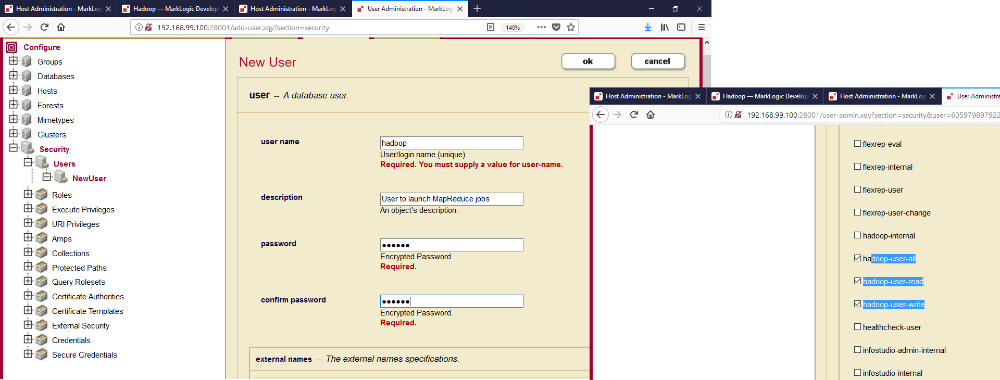

:toc: macro
:numbered:

toc::[]

= C001 Hadoop for storage and Compute

  *Description:* This is a functional user story, and it will be solved during Iteration 2,
   starting on Wednesday January 17th

  *What is included in this task:* Get to know about the integration of different data sources through Spark.
  To achieve this we will:

  1) Use the MarkLogic Connector for Hadoop to export from MarkLogic databases to a Hadoop cluster
  2) Open a Spark SQL session to query the exported data, joining them with other rdd sources

== https://docs.marklogic.com/guide/mapreduce/quickstart[Getting Started with the MarkLogic Connector for Hadoop in your lab cluster]

***WORK IN PROGRESS***

=== https://docs.marklogic.com/guide/mapreduce/quickstart#id_19037[Security Requirements for MapReduce Jobs]

    The user with which a MapReduce job accesses MarkLogic Server must have appropriate privileges
    for the content accessed by the job, such as permission to read or update documents in the
    target database. Specify the user in the mapreduce.marklogic.input.username and
    mapreduce.marklogic.output.username job configuration properties.

    In addition, the input and output user must use one of the pre-defined roles listed below:

    Role	Description
    *hadoop-user-read*	Enables use of MarkLogic Server as an input source for a MapReduce job.
    This role does not grant any other privileges, so the mapreduce.marklogic.input.user might
    still require additional privileges to read content from the target database.

    *hadoop-user-write*	Enables use of MarkLogic Server as an output destination for a MapReduce
    job. This role does not grant any other privileges, so the mapreduce.marklogic.output.user might
    still require additional privileges to insert or update content in the target database.

    *hadoop-user-all*	Combines the privileges of hadoop-user-read and hadoop-user-write.

    The *hadoop-internal* role is for internal use only. Do not assign this role to any users.
    This role is used to amp special privileges within the context of certain functions of the
    Hadoop MapReduce Connector.

    Assigning this role to users gives them privileges on the system that you typically do not want
    them to have.

=== https://docs.marklogic.com/guide/mapreduce/quickstart#id_16099[Installing the MarkLogic Connector for Hadoop]

  [NOTE]
  ===
  Following vendor's documentation, adding links to the source that I've read.

  As soon as we get the whole loop we will make these steps into the Dockerfile, and also will rewrite this documentation
  accoring to the changes
  ===

  These instructions assume you have the following environment variables set:

    HADOOP_CONF_DIR : The directory containing your Hadoop Configuration files.
                      This location is dependent on your Hadoop distribution. For example, CDH uses
                      /etc/hadoop/conf by default.

    JAVA_HOME : The root of your JRE installation.

  Use the following procedure to install the MarkLogic Connector for Hadoop. You might need to modify some of the
  example commands, depending on your version of MarkLogic, the connector, or your Hadoop distribution.

  1) Download the MarkLogic Connector for Hadoop from

     http://developer.marklogic.com/products/hadoop

  2) Download XCC for Java from

     http://developer.marklogic.com/products/xcc

  3) Create these folders in ml1.local:

    docker@default:~$ docker exec -it ml1.local bash

    [root@ml1 /]# mkdir /space
    [root@ml1 /]# mkdir /space/marklogic
    [root@ml1 /]# mkdir /space/marklogic/mapreduce
    [root@ml1 /]# mkdir /space/marklogic/xcc

  4) Upload MarkXCC.Java-9.0.3.zip and Connector-for-Hadoop2-2.2.3.zip to their respective folders

    docker@default:/c/Users/atarinvi/Documents/2018-01-08 eDIN/MarkLogicDockerLab/marklogic-cluster/lib$
    docker cp Connector-for-Hadoop2-2.2.3.zip ml1.local:/space/marklogic/mapreduce

    docker@default:/c/Users/atarinvi/Documents/2018-01-08 eDIN/MarkLogicDockerLab/marklogic-cluster/lib$
    docker cp MarkXCC.Java-9.0.3.zip  ml1.local:/space/marklogic/xcc

 4) Install the unzip command and unpack the Connector-for-Hadoop2-2.2.3.zip and MarkXCC.Java-9.0.3.zip files

    [root@ml1 mapreduce]# yum install unzip

    [root@ml1 mapreduce]# unzip Connector-for-Hadoop2-2.2.3.zip
    [root@ml1 xcc]# unzip MarkXCC.Java-9.0.3.zip

  Hadoop must be configured to find the MarkLogic Connector for Hadoop libraries before you can use MarkLogic Server
  in a MapReduce job. See Configuring Your Environment to Use the Connector.

=== https://docs.marklogic.com/guide/mapreduce/quickstart#id_16099[Configuring Your Environment to Use the Connector]

  [NOTE]
  ---
  Following vendor's documentation, adding links to the source that I've read.

  As soon as we get the whole loop we will make these steps into the Dockerfile, and also will rewrite this documentation
  accoring to the changes
  ---

  Before using the MarkLogic Connector for Hadoop with your Hadoop installation for the first time, set the
  environment variables described in this section. Only HADOOP_CLASSPATH is required, but the rest of this guide
  assumes you set the optional variables.

    [root@ml1 ~]# export CONNECTOR_HOME=/space/marklogic/mapreduce
    [root@ml1 ~]# export XCC_HOME=/space/marklogic/xcc
    [root@ml1 ~]# export HADOOP_CLASSPATH=$HADOOP_CLASSPATH:$CONNECTOR_HOME/lib/commons-modeler-2.0.1.jar
    [root@ml1 ~]# export HADOOP_CLASSPATH=$HADOOP_CLASSPATH:$CONNECTOR_HOME/lib/marklogic-mapreduce2-2.2.3.jar
    [root@ml1 ~]# export HADOOP_CLASSPATH=$HADOOP_CLASSPATH:$XCC_HOME/lib/marklogic-xcc-9.0.3.jar

    [root@ml1 main]# echo $HADOOP_CLASSPATH
    :/space/marklogic/mapreduce/lib/commons-modeler-2.0.1.jar:
    /space/marklogic/mapreduce/lib/marklogic-mapreduce2-2.2.3.jar:
    /space/marklogic/xcc/lib/marklogic-xcc-9.0.3.jar

    [root@ml1 ~]# export LIBJARS=$CONNECTOR_HOME/lib/commons-modeler-2.0.1.jar,$CONNECTOR_HOME/lib/marklogic-mapreduce2-2.2.3.jar,$XCC_HOME/lib/marklogic-xcc-9.0.3.jar

    [root@ml1 ~]# echo $LIBJARS
    /space/marklogic/mapreduce/lib/commons-modeler-2.0.1.jar,
    /space/marklogic/mapreduce/lib/marklogic-mapreduce2-2.2.3.jar,
    /space/marklogic/xcc/lib/marklogic-xcc-9.0.3.jar

  Let's make a script so that everytime we open a session, the environment is configured:

  Hadoop MapReduce and the MarkLogic Connector for Hadoop are now ready for use.

=== https://docs.marklogic.com/guide/mapreduce/quickstart#id_92175[Running the HelloWorld Sample Application]

  [NOTE]
  ---
  Following vendor's documentation, adding links to the source that I've read.

  As soon as we get the whole loop we will make these steps into the Dockerfile, and also will rewrite this documentation
  accoring to the changes
  ---

The section walks through configuring and running a simple HelloWorld sample job, assuming MarkLogic Server and
Apache Hadoop are installed on the same single node, as described in Installing the MarkLogic Connector for Hadoop.

The following steps are covered:

    Selecting the App Server and Database
    Loading the Sample Data
    Configuring the Job
    Running the Job

Selecting the App Server and Database

The MarkLogic Connector for Hadoop requires a MarkLogic Server installation configured with an XDBC App Server. When you install MarkLogic Server, a suitable XDBC App Server attached to the Documents database comes pre-configured on port 8000.

The example commands in this guide assume you're using this port 8000 App Server and database, and therefore no additional setup is required.

However, you can choose to use a different database or App Server and database:

    To use the pre-configured App Server on port 8000 with a different database, set the com.marklogic.output.databasename configuration property when you follow the steps in Configuring the Job. (A similar property exists for overriding the default database when using MarkLogic for output.)
    To create your own XDBC App Server on a different port, attached to a different database, see the Administrator's Guide, then configure your job appropriately when you get to Configuring the Job.

Loading the Sample Data

This section covers loading the sample data in two ways: Using Query Console to load the data using simple XQuery, or using the MarkLogic Content Pump (mlcp) command.

    Loading Sample Data with mlcp
    Loading Sample Data Manually

Loading Sample Data with mlcp

MarkLogic Content Pump (mlcp) is a command line tool transferring content into or out of MarkLogic Server, or copying content between MarkLogic Server instances.

Before running this procedure, you should have mlcp installed and the mlcp bin/ directory on your path; for details, see Installation and Configuration in the mlcp User Guide.

Follow these instructions to initialize the input database using MarkLogic Content Pump (mlcp).

    Create a directory to use as your work area and cd into it. This directory can be located anywhere. For example:

    mkdir /space/examples/hello
    cd /space/examples/hello

    Create a data subdirectory to hold the sample data files. For example:

    mkdir data

    Create a text file called 'hello.xml' in your data directory with the contents shown below:

    <data><child>hello mom</child></data>

    For example, run the following command:

    cat > data/hello.xml
    <data><child>hello mom</child></data>
    ^D

    Create a text file called 'world.xml' in your data directory with the contents shown below:

    <data><child>world event</child></data>

    For example, run the following command:

    cat > data/world.xml
    <data><child>world event</child></data>
    ^D

    Use mlcp to load the input files into the database you created in Selecting the App Server and Database. Use a username and password with update privileges for the input database. Use the port number of the XDBC App Server you previously created. Use the -output_uri_replace option to strip off the directory prefix from the database document URI. For example:

    $ mlcp.sh import -username user -password password -host localhost \
        -port 8000 -input_file_path /space/examples/hello/data \
        -output_uri_replace "/space/examples/hello/data/,''"

    Optionally, use Query Console to confirmthe load: Open Query Console and click the Explore button at the top of the query editor to examine the database contents. You should see hello.xml and world.xml in the database.

You can also use mlcp to load files from HDFS by specifying an HDFS path for -input_file_path. For example, if your files are in HDFS under /user/me/hello/data, then you could use the following command:

$ mlcp.sh import -username user -password password -host localhost \
    -port 8000 -input_file_path hdfs:/user/me/hello/data \
    -output_uri_replace "/user/me/hello/data/,''"

Loading Sample Data Manually

Follow these instructions to initialize the input database with the sample documents using Query Console. For details about Query Console, see the Query Console User Guide.

To load the database with the sample data:

    Using your browser, launch Query Console on the MarkLogic Server instance to be used as an input source. For example, if the input XDBC App Server is running on myhost, visit this URL in the browser:

    http://myhost:8000/qconsole

    Create a new query in Query Console and replace the default contents with the following:

    xquery version "1.0-ml";

    let $hello := <data><child>hello mom</child></data>
    let $world := <data><child>world event</child></data>

    return(
      xdmp:document-insert("hello.xml", $hello),
      xdmp:document-insert("world.xml", $world)
    )

    In the Content Source dropdown, select the input XDBC App Server you configured for input in Selecting the App Server and Database.
    Select Text as the output format and click Run to execute the query.
    Click the Explore button at the top of the query editor to examine the database contents. You should see hello.xml and world.xml in the database.

Configuring the Job

Before running the HelloWorld sample job, set the connector configuration properties that identify the MarkLogic Server user and instance for input and output.

Although the input and output MarkLogic Server instances and users can be different, this example configures the job to use the same host, port, and database for both input and output.

Configuration also includes an input and an output user name and password. Choose (or create) a MarkLogic user with sufficient privileges to access your XDBC App Server, and read and insert documents in the attached database. If using a non-admin user, assign the user to the hadoop-user-all role. For details, see Security Requirements for MapReduce Jobs.

To configure the job:

    Copy the marklogic-hello-world.xml configuration file from $CONNECTOR_HOME/conf to your work area. For example:

    $ cp $CONNECTOR_HOME/conf/marklogic-hello-world.xml /space/examples/hello

    Edit your local copy of marklogic-hello-world.xml to configure your input and output host name, port,
    user name, and password. Set the following parameters to match your environment:

    mapreduce.marklogic.input.username
    mapreduce.marklogic.input.password
    mapreduce.marklogic.input.host
    mapreduce.marklogic.input.port
    mapreduce.marklogic.output.username
    mapreduce.marklogic.output.password
    mapreduce.marklogic.output.host
    mapreduce.marklogic.output.port

    The configured input user must have sufficient privileges to access the XDBC App Server identified by the input host/port and to read documents from the input database.

    The configured output user must have sufficient privileges to access the XDBC App Server identified by the output host/port and to insert documents in the output database.

For example, if your MarkLogic installation is on localhost and you use the pre-configured App Server on port 8000 with the username and password 'my-user' and 'my-password' for input, then your input connection related property settings should be similar to the following after editing:

<property>
  <name>mapreduce.marklogic.input.username</name>
  <value>my-user</value>
</property>
<property>
  <name>mapreduce.marklogic.input.password</name>
  <value>my-password</value>
</property>
<property>
  <name>mapreduce.marklogic.input.host</name>
  <value>localhost</value>
</property>
<property>
  <name>mapreduce.marklogic.input.port</name>
  <value>8000</value>
</property>

Your output connection related property settings should have similar values.
Running the Job

The HelloWorld sample reads the first word of text from the input documents, concatenates the words into a string, and saves the result as HelloWorld.txt. Assuming the database contains only the documents created in Loading the Sample Data, the output document contains the phrase 'hello world'. If your database contains additional documents, you get different results.

To view the sample code, see $CONNECTOR_HOME/src/com/marklogic/mapreduce/examples.

Use the following procedure to run the example MapReduce job:

    If you are not already in your work area, change to that directory. For example:

    cd /space/examples/hello

    Ensure the hadoop command is in your path.
    Run the HelloWorld job using the following command. Modify the connector JAR file name as needed for your installation.

    hadoop jar \
      $CONNECTOR_HOME/lib/marklogic-mapreduce-examples-version.jar \
      com.marklogic.mapreduce.examples.HelloWorld -libjars $LIBJARS \
      -conf marklogic-hello-world.xml

The -conf command line option tells Hadoop where to get application-specific configuration information. You can also add a configuration directory to HADOOP_CLASSPATH.

As the job runs, Hadoop reports the job progress to stdout. If the sample job does not run or does not produce the expected results, see Troubleshooting and Debugging.

Near the end of the job output, you should see text similar to the following. Notice there are 2 map input records (hello.xml and world.xml), 2 map output records (the first word from each input record), and 1 reduce output record (HelloWorld.txt).

timestamp INFO mapreduce.Job:  map 100% reduce 100%
timestamp INFO mapreduce.Job: Job jobId completed successfully
timestamp mapreduce.Job: Counters: 33
        File System Counters
                ...
        Map-Reduce Framework
                Map input records=2
                Map output records=2
                Map output bytes=20
                Map output materialized bytes=30
                Input split bytes=91
                Combine input records=0
                Combine output records=0
                Reduce input groups=1
                Reduce shuffle bytes=30
                Reduce input records=2
                Reduce output records=1

Use Query Console to explore the output database and examine the output document, HelloWorld.txt. The document should contain the phrase 'hello world'.

If you do not see the expected output, see the tips in Troubleshooting and Debugging.

=== https://docs.marklogic.com/guide/mapreduce/quickstart#id_54760[Making the Connector Available Across a Hadoop Cluster]

  [NOTE]
  ===
  Following vendor's documentation, adding links to the source that I've read.

  THIS IS THE SPECTED PRODUCTION SCENARIO: MARKLOGIC CLUSTER IN PRODUCTION SHOULD BE EXPECTED TO BE MOVING DATA
  TO AND FROM A HADOOP CLUSTER, NOT TO A LOCAL HADOOP PROCESS!

  FOLLOWED A MESSY DOCUMENTATION, USED AN OPENSOURCE GIT PROJECT PROVIDED AND FOUND AN ERROR.

  STILL TRYING TO FIX IT
  ===

  When you submit a MapReduce job to run on an Apache Hadoop cluster, the job resources must be accessible by the
  master Job Tracker node and all worker nodes. Job resources include the job JAR file, configuration files, and
  all dependent libraries. When you use the MarkLogic Connector for Hadoop in your job, this includes the
  connector and XCC JAR files.

  You must always have the job resources available on the Hadoop node where you launch the job. Depending on the
  method you use to make the job resource available across the cluster, dependent JAR files, such as the MarkLogic
  Connector for Hadoop libraries must be on the HADOOP_CLASSPATH on the node where you launch the job, as
  described in Configuring Your Environment to Use the Connector.

  Hadoop offers many options for making job resources available to the worker nodes, including:

  * Using the -libjars Hadoop command line option and parsing the options in your main class using
    org.apache.hadoop.util.GenericOptionsParser.

  * Bundling dependent libraries and other resources into your job JAR file.

  * Storing dependent libraries and other resources in HDFS or other shared file system and using the Apache
    Hadoop Distributed Cache to locate and load them.

  * Installing required software on all nodes in the cluster.

  The best solution depends upon the needs of your application and environment. See the Apache Hadoop
  documentation for more details on making resources available across a Hadoop cluster.

  This guide uses -libjars.

==== Accessing the Connector Source Code

  The MarkLogic Connector for Hadoop is developed and maintained as an open source project on GitHub.
  To access the sources or contribute to the project, navigate to the following URL in your browser:

  http://github.com/marklogic/marklogic-contentpump

  The GitHub project includes both the connector and the mlcp command line tool.

 *Steps to use this project:*

 1) Install Java in ml1.local container:

     [root@ml1 main]# yum install java-1.8.0-openjdk

 2) Download the zip, put it into ml1.local and unpack it:

   https://github.com/marklogic/marklogic-contentpump/archive/marklogic-contentpump.zip

   docker@default:/c/Users/atarinvi/Documents/2018-01-08 eDIN/MarkLogicDockerLab/marklogic-cluster/lib$
   docker cp marklogic-contentpump-master.zip ml1.local:/space/marklogic/marklogic-contentpump
   [root@ml1 marklogic-contentpump]# unzip marklogic-contentpump-master.zip

  3) Upload Cloudera's QuickStart /etc/hadoop/conf folder content to ml1.local as said om
  http://docs.marklogic.com/guide/mlcp/install#id_90074[Configuring Distributed Mode]:

  [root@ml1 ~]# mkdir /etc/hadoop
  [root@ml1 ~]# mkdir /etc/hadoop/conf

  docker@default:/c/Users/atarinvi/Documents/2018-01-08 eDIN/MarkLogicDockerLab/marklogic-cluster/resources/etc/hadoop/conf$
  docker cp README ml1.local:/etc/hadoop/conf

    [root@ml1 ~]# ls -rlht /etc/hadoop/conf/
    total 40K
    -rwxrwxrwx 1 1000 ftp 2.4K Feb 23  2016 yarn-site.xml
    -rwxrwxrwx 1 1000 ftp 1.1K Feb 23  2016 README
    -rwxrwxrwx 1 1000 ftp 2.9K Feb 23  2016 hadoop-metrics.properties
    -rwxrwxrwx 1 1000 ftp 1.4K Feb 23  2016 hadoop-env.sh
    -rwxrwxrwx 1 1000 ftp  12K Mar 23  2016 log4j.properties
    -rwxrwxrwx 1 1000 ftp 1.6K Apr  5  2016 mapred-site.xml
    -rwxrwxrwx 1 1000 ftp 3.7K Apr  5  2016 hdfs-site.xml
    -rwxrwxrwx 1 1000 ftp 1.9K Apr  5  2016 core-site.xml

  4) http://docs.marklogic.com/guide/mlcp/install#id_38144[Specifying the Hadoop Configuration File Location]:

    mlcp.sh command -hadoop_conf_dir /etc/hadoop/conf -Ddistributed=true

    [root@ml1 main]# ./mlcp.sh import -hadoop_conf_dir /etc/hadoop/conf -Ddistributed=true --libjars $LIBJARS
    Error: Could not find or load main class com.marklogic.contentpump.ContentPump

