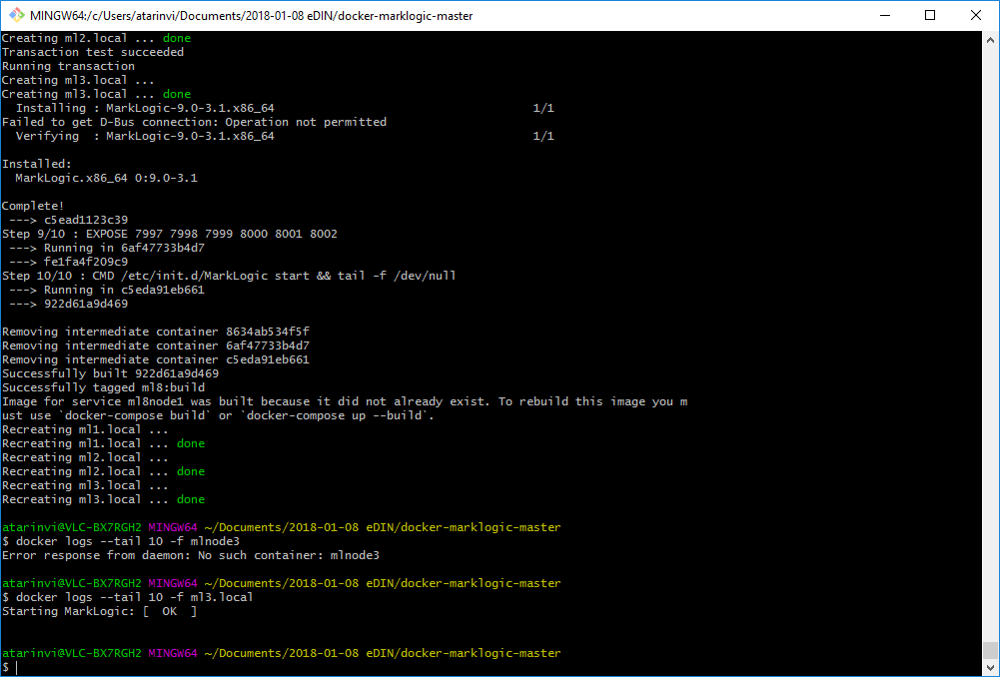

= Pre requisites

*Docker QuickStart*

You need to have it installed if your platform is Windows:

*MarkLogic*
Register your everis account here:

http://developer.marklogic.com/products

Then you can download Marklogic rpm if you want, for future releases, replacing new rpm versions instead of the currently
one that you have in the lib folders

= How to use your docker Quickstart machine

After starting your Docker QuickStart, connect to the default Docker repository

``atarinvi@VLC-BX7RGH2 MINGW64 ~/Documents/2018-01-08 eDIN/MarkLogicDockerLab
  $ eval $(docker-machine.exe env default)
``

= First step: Starting the lab for the first time

Create the network

``atarinvi@VLC-BX7RGH2 MINGW64 ~/Documents/2018-01-08 eDIN/docker-marklogic-master
$ docker network create lab-network
``

and launch the lab:

= Second step: Joining all the nodes into the cluster

After the containers have been created, started and linked together, simply point your browser to the Admin Interface port
of
http://192.168.99.100:8001 for hostname ml1.local,
http://192.168.99.100:18001 for hostname ml2.local
and
http://192.168.99.100:28001 for hostname ml3.local
, respectively.

Proceed through each node's MarkLogic post-installation steps. The MarkLogic Installation Guide has more information on
installation and adding a host to a cluster.

    On ml1.local, skip joining a cluster.
    On ml2.local and ml3.local, set the Host Name on the Join a Cluster page to localhost and leave the Admin Port at 8001.
    Accept the default settings on the next page.
    The next page confirms you are about to join a cluster.
    Configuration with the bootstrap host (first host in the cluster) is synchronized and the node becomes part of the cluster.

Then you are ready to start working with your brand new MarkLogic cluster!

= Third step: Register your cluster so that you can receive support from MarkLogic technical support department

= Stopping and starting your lab

``
atarinvi@VLC-BX7RGH2 MINGW64 ~/Documents/2018-01-08 eDIN/docker-marklogic-master
$ docker-compose -f marklogic-cluster/docker-compose.yml stop
Stopping quickstart.cloudera ... done
Stopping ml3.local           ... done
Stopping ml2.local           ... done
Stopping ml1.local           ... done

atarinvi@VLC-BX7RGH2 MINGW64 ~/Documents/2018-01-08 eDIN/docker-marklogic-master
$ docker-compose -f marklogic-cluster/docker-compose.yml start
Starting ml8node1 ... done
Starting ml8node2 ... done
Starting ml8node3 ... done
Starting cloudera ... done
``

= See the Cloudera QuickStart installation here

    docker@default:~$ docker exec -it quickstart.cloudera bash
    [root@quickstart /] hdfs dfs -ls /
    Found 5 items
    drwxrwxrwx   - hdfs  supergroup          0 2016-04-06 02:26 /benchmarks
    drwxr-xr-x   - hbase supergroup          0 2016-04-06 02:26 /hbase
    drwxrwxrwt   - hdfs  supergroup          0 2018-01-11 15:58 /tmp
    drwxr-xr-x   - hdfs  supergroup          0 2016-04-06 02:27 /user
    drwxr-xr-x   - hdfs  supergroup          0 2016-04-06 02:27 /var
    [root@quickstart /] /home/cloudera/cloudera-manager
    You must specify --express or --enterprise
    [root@quickstart /] /home/cloudera/cloudera-manager --enterprise

    WARNING: It is highly recommended that you run Cloudera Enterprise in a VM with
    at least 10 GB of RAM.

    WARNING: It is highly recommended that you run Cloudera Manager in a VM with at
    least 2 Virtual CPUs or cores. Please shutdown the VM, add an additional CPU or
    CPU core in your hypervisor, and restart the VM.

    You can override these checks by passing in the --force option,
    e.g:

        sudo /home/cloudera/cloudera-manager --force

    [root@quickstart /]~$ sudo /home/cloudera/cloudera-manager --enterprise --force
    [QuickStart] Shutting down CDH services via init scripts...
    kafka-server: unrecognized service
    could not open session
    could not open session
    could not open session
    could not open session
    JMX enabled by default
    Using config: /etc/zookeeper/conf/zoo.cfg
    [QuickStart] Disabling CDH services on boot...
    error reading information on service kafka-server: No such file or directory
    [QuickStart] Starting Cloudera Manager server...
    [QuickStart] Waiting for Cloudera Manager API...
    [QuickStart] Starting Cloudera Manager agent...
    [QuickStart] Activating trial license for Enterprise...
    [QuickStart] Configuring deployment...
    [QuickStart] Deploying client configuration...
    [QuickStart] Starting Cloudera Management Service...
    [QuickStart] Enabling Cloudera Manager daemons on boot...
    ________________________________________________________________________________

    Success! You can now log into Cloudera Manager from the QuickStart VM's browser:

        http://quickstart.cloudera:7180

        Username: cloudera
        Password: cloudera

    [root@quickstart /]

  You can check your Cloudera's URLs are up and running from here:

  Yarn:     http://192.168.99.100:8088
  Namenode: http://192.168.99.100:50070
  Hue:      http://192.168.99.100:8888
  Oozie:    http://192.168.99.100:11000

= https://docs.marklogic.com/guide/mapreduce/quickstart#id_16099[Installing the MarkLogic Connector for Hadoop]

= PoC backlog

== C000 Initial lab setup

  *Description:* After our discovery of tasks, this is a infrastructural task that we need to do in order to
   accomplish the rest of the tasks of this PoC it will be solved during Iteration 1, started on Wednesday
   January 10th

  *What is included in this task:* Provide to all the members of the team with a Docker platform where we can
   use to solve the rest of the tasks of this PoC.

  *What will be included on this task*

   There will be:

    * A Docker Compose lab with:

        - A MarkLogic 9.0 cluster with three nodes
        - A Cloudera QuickStart node
        - A MySQL node
        - An Oracle XE node

     * Documentation to install, configure and use the lab, including the information about the PoCs
       Actually is the one that you're currently reading, that will be evolving at the same time as we
       are burning Sprints.

== C001 Hadoop for storage and Compute

  *Description:* This is a functional user story, and it will be solved during Iteration 2,
   starting on Wednesday January 17th

  *What is included in this task:* Get to know about the integration of Marklogic and Hadoop.

== C002 Search and query database server with built-in search

  *Description:* This is a functional user story, and it will be solved during Iteration 3,
   starting on Wednesday January 24th

  *What is included in this task:* test of ACID transactions, REST API, RDF Triples, Indexes, Security.

  This task can be parallelized with C001

== C003 Clustered: faster time-to-results

  *Description:* This is an architectural user story, and it is included in the backlog for future iterations after
   finishing the iteration 3. If should be starting on Wednesday January 31st

  *What is included in this task:* On this task we would get base line of productors and consumers of data,
   behavior with load peaks and load ramp-ups.

  If we paralellize task C001 and C002 we can move this task to start earlier on Wednesday January 24th

== C004 Clustered: On-Cloud Deployment

  *Description:* This is an architectural user story, and it is also included in the backlog for future iterations
   after finishing the iteration 3. It's order could be interchangeable with task C003

  *What is included in this task:* This task is meant to check semantics, scalability and elasticity,
   high Availability and disaster, recovery and replication.

   It will take several sprints, and this task needs to have an Azure account