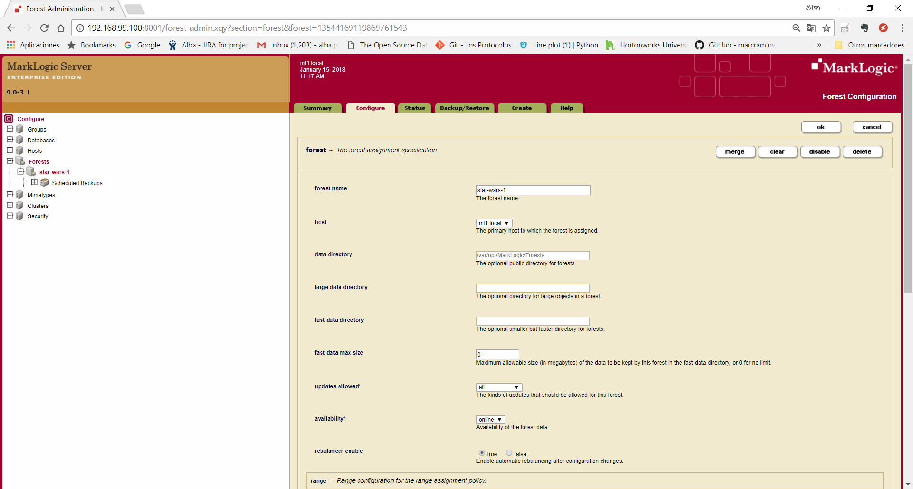
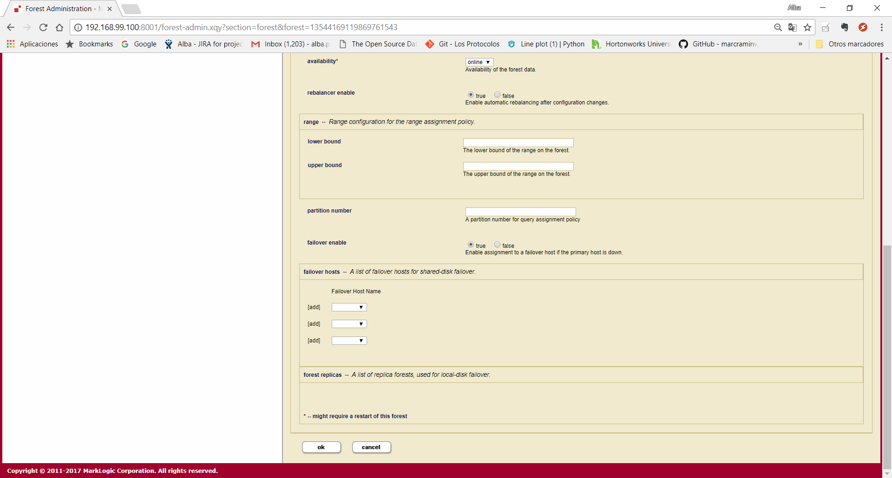
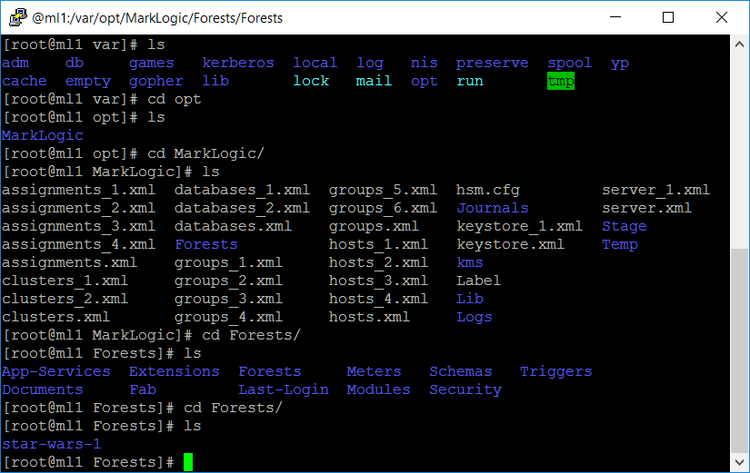
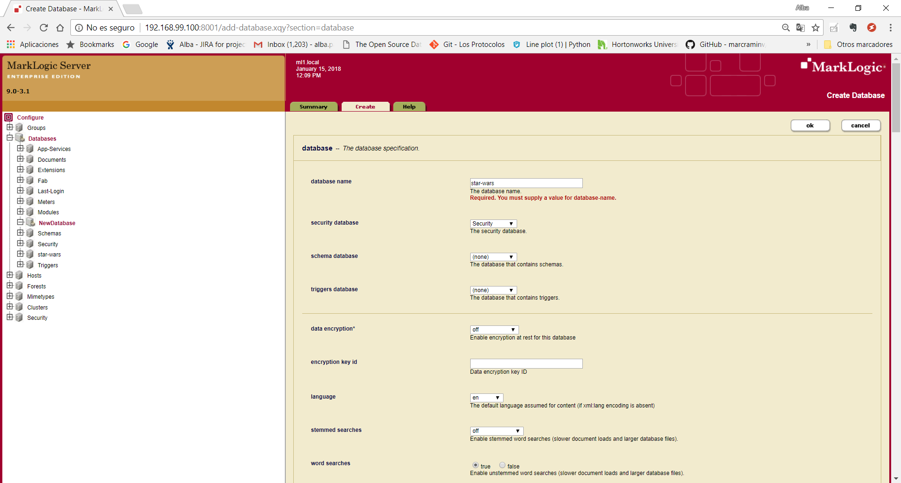
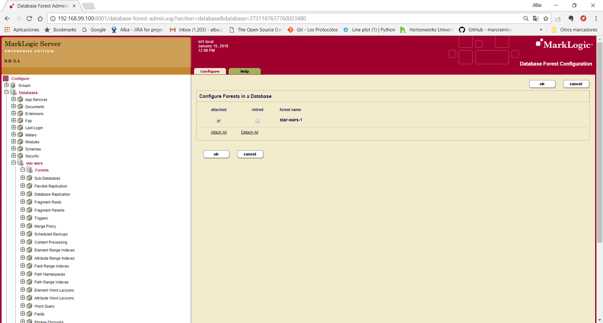
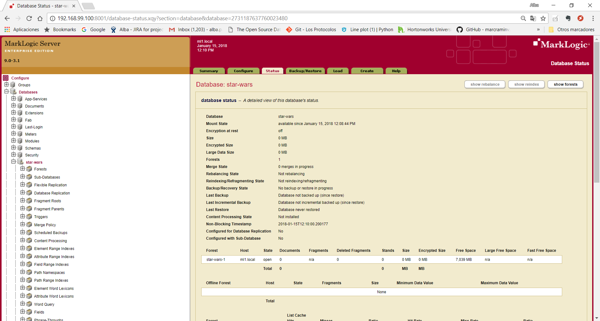
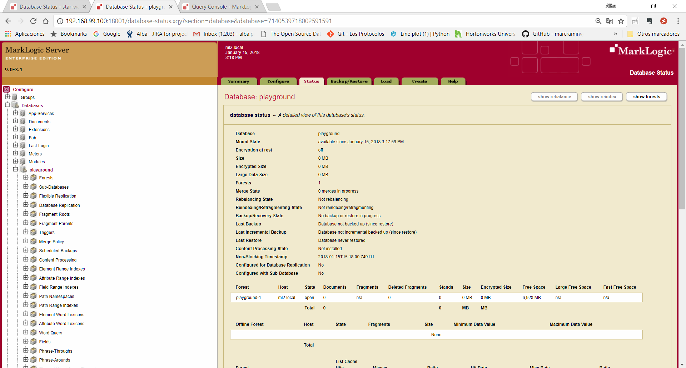

:toc: macro
:numbered:

= C002 Search and query database server with built-in search

toc::[]

== Introduction

*Description:* This is a functional user story, and it will be solved during Iteration 3,
   starting on Wednesday January 24th

*What is included in this task:* test of ACID transactions, REST API, RDF Triples, Bitemporality, Security.

This task can be parallelized with C001

== Understanding ways to communicate

*Common administrative interfaces include:*

* Admin Interface (port 8001)
* Admin API
* Configuration Manager (port 8002)
* Monitoring Dashboards (port 8002)

*Common development interfaces include:*

* Query Console (port 8000)
* XQuery (native)
* JavaScript (native)
* REST API
* Java API
* Node.js API
* XCC

=== http://docs.marklogic.com/guide/admin/forests[Creating a forest using Admin Interface]

A forest can be created through the Admin interface by using the Create tab in the Forests section.
To create a forest in a cluster host, go to
http://192.168.99.100:8001 for hostname ml1.local,
http://192.168.99.100:18001 for hostname ml2.local
and
http://192.168.99.100:28001 for hostname ml3.local

1 - In the Admin Interface (http://localhost:8001), select Forests on the left.

2 - Select the Create tab in the upper middle.

3 - Enter star-wars-1 in the forest name field, to give the forest a name.

4 -Leave the data directory blank, to have the forest created in the default data directory.

5 -Leave the rest of the options with their defaults.

6 -Click the ok button.

7 -If desired, in a command prompt window, enter ls /var/opt/MarkLogic/Forests to view the new forest:

=== http://docs.marklogic.com/guide/admin/databases[Creating a database using Admin Interface]

A database can be created through the Admin interface by using the Create tab in the databases section.

1- In the Admin Interface of the hostname ml1.local, select Databases on the left.

2- Select the Create tab in the upper middle.

3- For database name, enter star-wars.

4- Click the ok button, to create the database.

5- With the database created, click the Database->Forests link.

6- Select the checkbox to the left of the forest name.

7- Click the ok button.

8- To confirm that the forest is attached to the database, click the database name on the left and then click the Status tab.
    See that the number of forests is 1 and that the star-wars-1 forest is listed:

==== Create a second database

1- In the Admin Interface of the hostname ml2.local, under Configure, select Forests.

2- Select the Create tab.

3- Enter playground-1 in the forest name field, to give the forest a name.

4- Leave the data directory blank, to have the forest created in the default data directory.

5- Leave the rest of the options with their defaults.

6- Click the ok button.

7- On the left, select Databases.

8- Select the Create tab.

9- For database name, enter playground.

10- Click the ok button, to create the database.

11- With the database created, click the Database->Forests link.

12- Select the checkbox to the left of playground-1.

13- Click the ok button.

14- To confirm that the forest is attached to the database, click the database name on the left and then click the Status tab.
    See that the number of forests is 1 and that the playground-1 forest is listed:

=== Create databases and forests using Query Console

Query Console is a web-based MarkLogic interface, available at port 8000(ml1.local),18000(ml2.local) and 28000(ml3.local) respectively, that allows you to execute JavaScript or XQuery expressions in MarkLogic.

image:imagenes/C002_images/imagen08.png[imagen08.png]

=== Creating databases and forests using REST API

== Inserting Data into a Database
== Search
== Indexes
== Security
