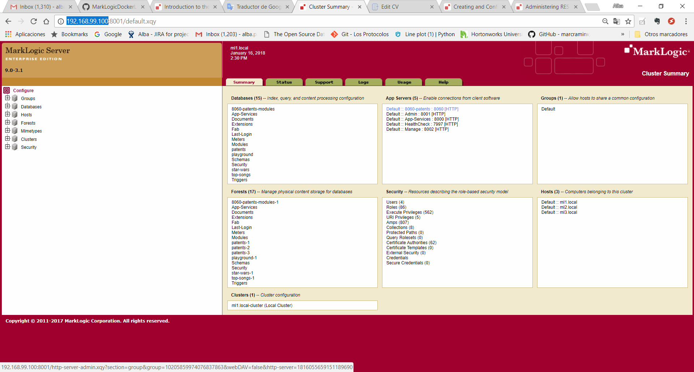
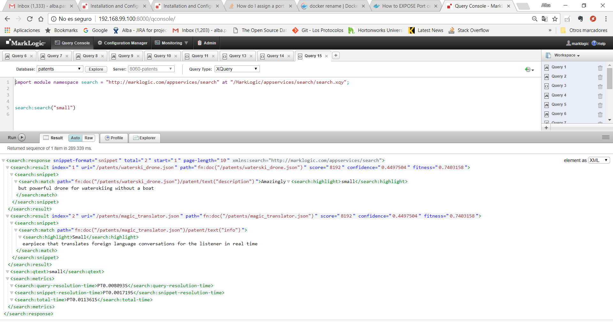
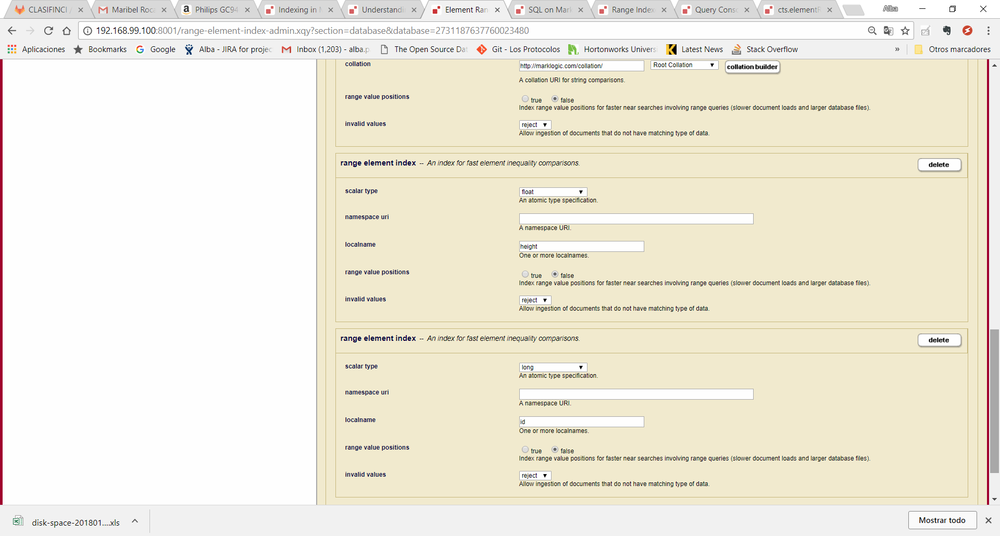
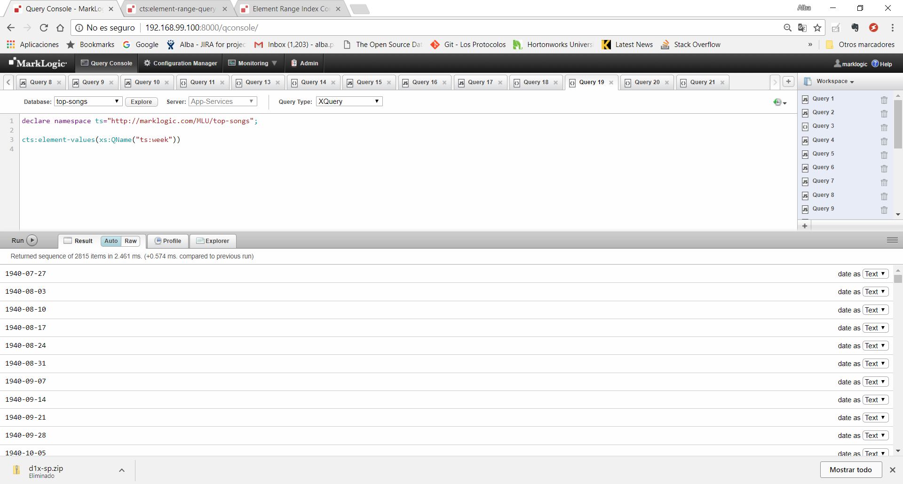

:toc: macro
:numbered:

= C002 Search and query database server with built-in search

toc::[]

== Introduction

*Description:* This is a functional user story, and it will be solved during Iteration 3,
   starting on Wednesday January 24th

*What is included in this task:* test of ACID transactions, REST API, RDF Triples, Bitemporality, Security.

This task can be parallelized with C001

== Understanding ways to communicate

*Common administrative interfaces include:*

* Admin Interface (port 8001)
* Admin API
* Configuration Manager (port 8002)
* Monitoring Dashboards (port 8002)

*Common development interfaces include:*

* Query Console (port 8000)
* XQuery (native)
* JavaScript (native)
* REST API
* Java API
* Node.js API
* XCC

=== http://docs.marklogic.com/guide/admin/forests[Creating a forest using Admin Interface]

A forest can be created through the Admin interface by using the Create tab in the Forests section.
To create a forest in a cluster host, go to
http://192.168.99.100:8001 for hostname ml1.local,
http://192.168.99.100:18001 for hostname ml2.local
and
http://192.168.99.100:28001 for hostname ml3.local

image::imagenes/C002_images/imagen01.png[imagen01.png]
image::imagenes/C002_images/imagen02.png[imagen02.png]

1 - In the Admin Interface (http://localhost:8001), select Forests on the left.

2 - Select the Create tab in the upper middle.

3 - Enter star-wars-1 in the forest name field, to give the forest a name.

4 -Leave the data directory blank, to have the forest created in the default data directory.

5 -Leave the rest of the options with their defaults.

6 -Click the ok button.

7 -If desired, in a command prompt window, enter ls /var/opt/MarkLogic/Forests to view the new forest:

=== http://docs.marklogic.com/guide/admin/databases[Creating a database using Admin Interface]

A database can be created through the Admin interface by using the Create tab in the databases section.

image:imagenes/C002_images/imagen04.png[imagen04.png]

1- In the Admin Interface of the hostname ml1.local, select Databases on the left.

2- Select the Create tab in the upper middle.

3- For database name, enter star-wars.

4- Click the ok button, to create the database.

5- With the database created, click the Database->Forests link.

6- Select the checkbox to the left of the forest name.

7- Click the ok button.

8- To confirm that the forest is attached to the database, click the database name on the left and then click the Status tab.
    See that the number of forests is 1 and that the star-wars-1 forest is listed:

image:imagenes/C002_images/imagen06.png[imagen06.png]

==== Create a second database

1- In the Admin Interface of the hostname ml2.local, under Configure, select Forests.

2- Select the Create tab.

3- Enter playground-1 in the forest name field, to give the forest a name.

4- Leave the data directory blank, to have the forest created in the default data directory.

5- Leave the rest of the options with their defaults.

6- Click the ok button.

7- On the left, select Databases.

8- Select the Create tab.

9- For database name, enter playground.

10- Click the ok button, to create the database.

11- With the database created, click the Database->Forests link.

12- Select the checkbox to the left of playground-1.

13- Click the ok button.

14- To confirm that the forest is attached to the database, click the database name on the left and then click the Status tab.
    See that the number of forests is 1 and that the playground-1 forest is listed:

image:imagenes/C002_images/imagen07.png[imagen07.png]

=== http://docs.marklogic.com/guide/qconsole[Creating databases and forests using Query Console]

Query Console is a web-based MarkLogic interface, available at port 8000(ml1.local),18000(ml2.local) and 28000(ml3.local) respectively, that allows you to execute JavaScript or XQuery expressions in MarkLogic.

1- Go to http://192.168.99.100:28000
2- See that you are viewing Query Console
image:imagenes/C002_images/imagen08.png[imagen08.png]
3- In the Content Source drop-down list, view the list of databases that already exist (playground was created on ml2.local)
ce
image:imagenes/C002_images/imagen09.png[imagen09.png]
4- In the Query Type drop-down list, notice the query languages:

image:imagenes/C002_images/imagen11.png[imagen08.png]

5- Now, use the admin API to define a forest named top-songs-1, a databases named top-songs, and then attaches the forest to the database.
Write this Javascript code in the query console:

    var admin = require('/MarkLogic/admin.xqy');

    var forestConfig = admin.getConfiguration();
    forestConfig = admin.forestCreate(forestConfig, 'top-songs-1', xdmp.host(), '', '', '');
    admin.saveConfiguration(forestConfig);

    var dbConfig = admin.getConfiguration();
    dbConfig = admin.databaseCreate(dbConfig, 'top-songs', xdmp.database('Security'), xdmp.database('Schemas'));
    admin.saveConfiguration(dbConfig);

    var forestAttachConfig = admin.getConfiguration();
    forestAttachConfig = admin.databaseAttachForest(forestAttachConfig, xdmp.database('top-songs'), xdmp.forest('top-songs-1'));
    admin.saveConfiguration(forestAttachConfig);

6- In Query Console, check that you have JavaScript selected as the Query Type.

7- Realize that, for this code (which is defining a new database), the database selected in the Content Source list is irrelevant.

8- Click the Run button, to execute the code.

9- Realize that the return message of your query response was empty is expected, because you did not retrieve any documents from the selected database.

10- Reload the browser page (F5)

11- Look in the Content Source list to see that the top-songs database now appears in the list:

=== http://docs.marklogic.com/guide/rest-dev[Creating databases and forests using REST API]

The REST Client API provides a set of RESTful services for creating, updating, retrieving, deleting and query documents and metadata.
You can use the REST Client API to work with XML, JSON, text, and binary documents.

REST API client applications interact with MarkLogic Server through a REST API instance, a specially configured HTTP App Server. Each REST API instance is intended to service a single content database and client application.

To sending HTTP request you can use curl or equivalent:

1- To create a new REST instance, send a POST request to the /rest-apis service on port 8002(ml1.local) with a URL of the form "http://host:8002/version/rest-apis":

    http://192.168.99.100:8002/v1/rest-apis

2- The POST body should contain instance configuration information in XML or JSON. Setting the HTTP content-type header to "application/xml" or "application/json" to indicate the content format.
The configuration data must specify at least a name for the instance. Optionally, you can specify additional instance properties such as a group name, database name, modules database name, and port.

Create the instance content (rest_api.json):

    {
      "rest-api": {
        "name": "8060-patents",
        "database": "patents",
        "port": "8060",
        "forests-per-host": 1
      }
    }

3- Create the instance and database "patents" with 1 forest/host by sending a POST request to /rest/apis on port 8002:

    curl --anyauth --user marklogic:marklogic -X POST -d@"rest_api/rest_api.json" -i -H "Content-type: application/json" http://192.168.99.100:8002/v1/rest-apis

4- Execute the curl instance in a command prompt.
5- After a few seconds, see that the response says HTTP/1.1 201 Created:

  HTTP/1.1 401 Unauthorized
  Server: MarkLogic
  WWW-Authenticate: Digest realm="public", qop="auth", nonce="35dcdb3dead88e:o4nMbo5VpcN9XD7Z2n+RNA==", opaque="130674700aba9d6e"
  Content-Type: text/html; charset=utf-8
  Content-Length: 209
  Connection: Keep-Alive
  Keep-Alive: timeout=5

  HTTP/1.1 201 Created
  Server: MarkLogic
  Content-Length: 0
  Connection: Keep-Alive
  Keep-Alive: timeout=5

6- Now, in the Admin Interface, click the Configure link on the left, to be able to see the "patents" databases listed under Databases, the patents-1 forest listed under Forests, and the 8060-patents application server listed under App Servers:

== Inserting Data into a Database

=== Understanding Marklogic storage

==== Storage Data

Data is stored in MarkLogic as a document. This data model is extremely beneficial for loading content as-is, with no schema required.

Document formats supported are JSON, XML, RDF, text, and binary.

Documents in other formats (e.g. PDF, Word, Excel, PowerPoint, and HTML) can be converted to XML or JSON using MarkLogic's conversion functions.

JSON document example:

    {
    "recipe":
      {
        "name": "tofu soup",
        "ingredients": ["tofu block", "carrots", "mushrooms", "green onions", "coconut milk"],
        "directions":
         {
           "preparation": "Chop ingredients into medium-size cubes.",
           "cooking":
           {
             "step1": "In a large pot, combine all ingredients.",
             "step2": "Cook on medium heat for 45 minutes."
           }
         }
      }
    }

==== URI
To be able to address any given document in a MarkLogic database, each document has a unique URI (Uniform Resource Identifier). For example, the following URI might be used for the document illustrated above:

    /recipes/tofu-soup.json

The URI is a string that is defined when a document is being loaded. It is common to put some thought into the URI that you will assign to each of your documents, as any directories in a URI can be used to retrieve documents from the database.

The URI does not refer to the physical location of a document in the database, but rather, provides a unique name for retrieving the document.

If another document is inserted at the same URI, it will replace the previous one.

==== Organizing Documents
Documents can be organized in a database via any directories in the path of a URI and/or via collections.

Specifying directories in the URI of a document provides a way to reference groups of documents in a database based on their URIs.

Example JavaScript reference to documents in a recipes directory:

    xdmp.directory("/recipes/")

Specifying collections for a document provides a way to tag a document with no regard for its URI.

Example collection assignment:

    xdmp.documentAddCollections("/recipes/tofu-soup.json", "vegetarian")

Example JavaScript to reference the documents in a collection named vegetarian:

    fn.collection("vegetarian")

A document can belong to more than one collection.

==== http://docs.marklogic.com/guide/ingestion[Loading Content Into MarkLogic Server]

There are many ways to insert documents into a MarkLogic database. Ways include:

* MarkLogic Content Pump
* REST API
* Java API
* Node.js API
* XCC
* XQuery functions
* JavaScript functions
* WebDAV
* MarkLogic Connector for Hadoop
* Content Processing Framework

=== Sharing data with MarkLogic docker containers
First of all, data files must be loaded to Marklogic containers. For it, use 'docker cp' command
to copy data from the default docker machine to the Marklogic containers. From default machine commnand line execute:

    docker@default:/c/Users/apastorr/MarkLogicDockerLab$ docker cp data/ ml1.local:/tmp

Now, check if data folder have been copied to /tmp in ml1.local container.

    docker@default:/c/Users/apastorr/MarkLogicDockerLab$ docker exec -it ml1.local b
    ash
    [root@ml1 /]# ls
    anaconda-post.log  dev  home  lib64  mnt  proc  run   srv  tmp  var
    bin                etc  lib   media  opt  root  sbin  sys  usr
    [root@ml1 /]# cd tmp
    [root@ml1 tmp]# ls
    data  ks-script-Rl3Umm  yum.log
    [root@ml1 tmp]#

Make the same with the others Marklogic containers.

=== Inserting Data through Query Console
Query Console can be used to insert documents into a MarkLogic database via JavaScript or XQuery.

*Inserting via Javascript*:

* The *xdmp.documentInsert()* function is commonly used to define a new document as it is being written to a database.
* The *xdmp.documentLoad()* function is commonly used to load a document that already exists, such as for loading a document from the file system.

*Inserting via XQuery*:

* The *xdmp:document-insert()* function is commonly used to define a new document as it is being written to a database.
* The *xdmp:document-load()* function is commonly used to load a document that already exists, such as for loading a document from the file system.

==== Load data in top-songs database:*

1. In a browser, navigate to Query Console, for example Query Console to ml1.local host(http://192.168.99.100:8000/qconsole/)

2. Click the + button to create a new tab.Select top-songs for the database, and JavaScript as the Query Type.
3. Enter the following javascript code:

    declareUpdate();
    xdmp.documentLoad('/tmp/data/top-songs_data/songs/The-Doors+Light-My-Fire.xml')

4. With the top-songs database selected as the content source, press Run.
5. With the top-songs database still selected, click the Explore button.

6. Modify the JavaScript expression to specify a custom URI and run:

    declareUpdate();
    xdmp.documentLoad('/tmp/data/top-songs_data/songs/The-Doors+Light-My-Fire.xml', {'uri': '/songs/The-Doors+Light-My-Fire.xml'})

7. Press the Explore button.See that the new document has a URI of /songs/The-Doors+Light-My-Fire.xml:

8. Add a new tab and run the following, to delete the old document (can copy from unit05/ex03e.txt):

    declareUpdate();
    xdmp.documentDelete('/tmp/data/top-songs_data/songs/The-Doors+Light-My-Fire.xml')

9. Press the Explore button, to see that the document has been deleted:

10. Load all of the top-songs documents from the file system, specifying custom URIs:

    declareUpdate();
    var pathToSongDocs = '/tmp/data/top-songs_data/songs';
    var pathToImages = '/tmp/data/top-songs_data/images';
    var xmlDocs = xdmp.filesystemDirectory(pathToSongDocs);
    var binaryDocs = xdmp.filesystemDirectory(pathToImages);
    xmlDocs.forEach(function(doc) {
      xdmp.documentLoad(doc.pathname, {'uri': '/songs/' + doc.filename})
    });
    binaryDocs.forEach(function(doc) {
      xdmp.documentLoad(doc.pathname, {'uri': '/images/' + doc.filename})
    });

=== Inserting Data through the REST API
Documents can be written to a MarkLogic database through the REST API by using the REST API documents service. Specifically, a PUT can be used to specify the URI and content for a document.

*Writing an XML Document*

An XML document can written to a MarkLogic database through a REST API instance by setting the content type to be application/xml, providing the XML, and, optionally, specifying a URI for the document being inserted.

    curl --anyauth --user admin:admin -X PUT -i -H "Content-Type: application/xml" -d "<patent><title>Waterski drone</title><inventor>Ruth</inventor><description>Amazingly small but powerful drone for waterskiing without a boat</description></patent>" "http://localhost:8060/v1/documents?uri=/patents/waterski_drone.xml"

*Writing an JSON Document*

JSON document can written to a MarkLogic database through a REST API instance by setting the content type to be application/json, providing the JSON, and, optionally, specifying a URI for the document being inserted.

    curl --anyauth --user admin:admin -X PUT -i -H "Content-Type: application/json" -d '{"patent": {"title": "Waterski drone", "inventor": "Ruth", "description": "Amazingly small but powerful drone for waterskiing without a boat"}}' "http://localhost:8060/v1/documents?uri=/patents/waterski_drone.json"

*Inserting a Document from the File System*

A document on the file system can be inserted into a MarkLogic database through a REST API instance through the use of the -T option, specifying the location of the file on the file system, and, optionally, specifying a URI for the document being inserted.

    curl --anyauth --user admin:admin -X PUT -i -H "Content-Type: application/json" -T Desktop/mls-fundamentals/unit05/patents_data/airless_diving.json "http://localhost:8060/v1/documents?uri=/patents/airless_diving.json"

*Accesing a Document*

To access a document through the REST API, its URI can be referenced with a GET.

    curl --anyauth --user admin:admin -X GET "http://localhost:8060/v1/documents?uri=/patents/airless_diving.json"

=== https://docs.marklogic.com/guide/mlcp[Using MarkLogic Content Pump to Bulk Load]

==== https://docs.marklogic.com/guide/mlcp/install[Installation]

*Installing mlcp on ml1.local host:*

0) Enter to ssh ml1.local host

    docker exec -it ml1.local bash

1) Download mlcp from http://developer.marklogic.com/products/mlcp
2) Unzip mlcp-Hadoop2-1.3-2-bin.zip
3) Put the mlcp bin directory on your path

    export PATH=${PATH}:/tmp/mlcp-Hadoop2-1.3-2/bin

4) If you plan to use mlcp in distributed mode, you must have a Hadoop installation and must configure your environment so mlcp can find your Hadoop installation:
    https://docs.marklogic.com/guide/mlcp/install#id_90074

==== Local mode

*Use mlcp to bulk load documents into the star-wars database*

1) Set up an XDBC server so that MLCP will be able to communicate with the star-wars database:

    In the Admin Interface (http://localhost:8001), select Configure - Groups - Default - App Servers.

    Select the Create XDBC tab.

    For xdbc server name, enter 8070-star-wars.

    For root, enter /.

    For port, enter 8070.

    For modules, leave (file system) selected.

    For database, select star-wars.

    Click the ok button.

    Click the Configure link (far left), to see the new XDBC server listed on the summary page:

2) Use mlcp command in ml1.local host to load documents into the star-wars databse:

    mlcp.sh import -mode local -host 192.168.99.100 -port 8070 -username marklogic -password marklogic -input_file_path /tmp/data/star-wars_data -output_uri_replace "tmp/data/star-wars_data/data,'character',/tmp/data/star-wars_data/images,'image'"

3) See that the commnad ran succesfully, loading 51 documents:

4) In Query Console, select the star-wars database and click the explore button to see all documents:

==== Distributed mode (in COO1 Hadoop task)

== http://docs.marklogic.com/guide/search-dev.pdf[Search]

=== http://docs.marklogic.com/js/cts/constructors[Search query using Javascript functions]

In query console, select patents database and query type javascript

1) Simple word search

    cts.search("small")

2) Json property word search

    cts.search(cts.jsonPropertyWordQuery("inventor","ruth"))

3) Returns a query specifying the set difference of the matches specified by two sub-queries

    cts.search(cts.andNotQuery(
          cts.wordQuery("small"),
          cts.wordQuery("drone")))

image:imagenes/C002_images/imagen23.png[imagen23.png]

4) Returns a query specifying the intersection of the matches specified by the sub-queries.

    cts.search(cts.andQuery(["small",
      cts.directoryQuery("/patents/", "1")]))

5) Search document by URIs

    cts.search(cts.documentQuery("/patents/airless_diving.json"))

=== http://docs.marklogic.com/cts.documentQuery[Search query using XQuery function]

1. Simple word search

    cts:search(fn:doc(), "diving")

2. Json property word search

    cts:search(fn:doc(), cts:json-property-word-query("inventor", "tamas"))

3. Find docments on directory

    cts:search(fn:doc(), cts:directory-query("/patents/"))

4. Boosting relevance score with a second query relevance (the first 10)

    cts:search(fn:collection(),
           cts:boost-query(cts:word-query("small"),
                           cts:word-query("drone", (), 10.0)
           )
         )

=== http://docs.marklogic.com/cts/constructors[Search API XQuery]

1. Import search api module

    import module namespace search = "http://marklogic.com/appservices/search" at "/MarkLogic/appservices/search/search.xqy";
    search:search("small")

2. Realize that the result could be used by application code to display the number of documents returned, as well as highlighting and snippets for the matches.

=== http://docs.marklogic.com/REST/client/search[REST API search service]

1. Simple word search

    curl --anyauth --user marklogic:marklogic -X GET "http://192.1
    68.99.100:8060/v1/search?q=diving"

image:imagenes/C002_images/imagen26.png[imagen26.png]

== https://docs.marklogic.com/guide/concepts/indexing[Indexes]
Marklogic provides baseline indexing of the words and structure of every document that gets loaded. As a document gets loaded into MarkLogic database, Marklogic creates an index of all os the words in the document, as well as the structure of the document.

Along with the baseline indexing of a document's words and structure, additional indexes can be defined for a database, to speed up the performance of an application. Which indexes would help the performance of a given application depend on the application itself.
In addition, some MarkLogic search features, such facets and semantics, require that supporting indexes exist.

In general, the cost of supporting additional indexes is increased disk space and document load times. As more and more indexes are maintained, search performance increases and document load speed decreases.

=== Range Indexes
Range indexes enable you to add search conditions based on inequalities (for example, price < 100.00 or date ? 2007-01-01). In some cases, documents can incorporate numeric, date or other typed information.
Specifying range indexes for these elements and/or attributes will substantially accelerate the evaluation of these queries.

==== Search with indexes
Defining a range index also allows you to use the range query constructors (cts:element-range-query and cts:element-attribute-range-query) in cts:search operations, making it easy to compose complex range-query expressions to use in searches. For details, see the Using Range Queries in cts:query Expressions chapter in the Search Developer's Guide.

==== Element Range Index
A range index on a XML element or JSON property

1) In the Admin Interface (http://localhost:8001), select Configure - Databases - star-wars.

2) In the left navigation, select Element Range Indexes.

3) Select the Add tab.

4) For scalar type, select string.

5) For localname, enter name (document json property)

6) Click the ok button.

image:imagenes/C002_images/imagen27.png[imagen27.png]

7) To see that the element range index now exists, in Query Console, run the following (can copy from unit08/ex02.txt), with the database set to star-wars and the Query Type set to JavaScript:

    cts.search(cts.jsonPropertyRangeQuery("name", "<", "e"));

8) Return all names that begin for a letter < e.

9) Create new element range indexes with other properties:

For xml files:

1) Check xml structure in top-songs database.

2) In the Admin Interface (http://localhost:8001), select Configure - Databases - top-songs.

3) In the left navigation, select Element Range Indexes.

4) Create a range element index for the xml element week:

==== Attribute Range Index
A range index on an attribute in an XML element.

Following before steps but selecting Attribute Range Indexes instead.

==== Path Range Index
A range index on an XML element, XML attribute, or JSON property as defined by an XPath expression.
You can create the same type of index with a path range index as you can with an element or attribute range index. Path range indexes are useful in circumstances in which an element or attribute range index will not work. For example, you may have documents with the same element name appearing under different parent elements and you only want to index the elements appearing under one of the parent elements. In this case, a path range index is required to correctly index that element.

1) Create a path namespace:

2) Create a path range index:

image:imagenes/C002_images/imagen39.png[imagen39.png]

3) Search path range index query:

==== Observaciones
No se ha apreciado una gran diferencia en el espacio ocupado antes y despues de indexar las diferentes bases de datos.

=== https://docs.marklogic.com/guide/search-dev/wildcard#id_61884[Wildcard searches]
Wildcard searches use character indexes, lexicons, and trailing wildcard indexes to speed performance. To ensure that wildcard searches are fast, you should enable at least one wildcard index (three character searches, trailing wildcard searches, two character searches, and/or one character searches) and fast element character searches (if you want fast searches within specific elements) in the Admin Interface database configuration screen. Wildcard searches are disabled by default. If you enable character indexes, you should plan on allocating an additional amount of disk space approximately three times the size of the source content.

* *"The three character searches index combined with the word lexicon provides the best performance for most queries."*

==== Three character searches index

1) Select star-wars database in the admin interface.

2) In the configure tab you can find the three character searches index. Change it to true value.

==== Word Lexicons
MarkLogic Server allows you to create a word lexicon that is restricted to a particular XML element, XML attribute, JSON property, or field. You can also define a field word lexicon across a collation. A word lexicon stores all of the unique words that are stored in the specified element, attribute, or JSON property.
Word lexicons are used in wildcard searches (when wildcarding is enabled).

1) Create a element word lexicon for the "alliance" json property in the star-wars database:

==== Annotations about performance and disk space

As with all indexing, choosing which indexes to use is a trade-off. Enabling more indexes provides improved query performance, but uses more disk space and increases load and reindexing time. For most environments where wildcard searches are required, MarkLogic recommends enabling the three character searches and a codepoint collation word lexicon, but disabling one and two character searches.

* Without active wildcards index:

        You can't use wildcards in searches:

* Disk space before and after indexing to allow wildcards searches.

    Before indexing. Usage star-wars dabatase disk space: 0.007GB

    After indexing (all wildcards index to true and element word lexicon created):
    Usage star-wars dabatase disk space: 0.017GB

* Performance search query test.

    Only three characters index activated. Query time: 4.482ms

    All wildcards index to true and element word lexicon created. Query time: 0.968ms

image:imagenes/C002_images/imagen48.png[imagen48.png]

== https://docs.marklogic.com/guide/semantics[Semantics]

=== Triple Index
=== SPARQL

== ACID transactions

